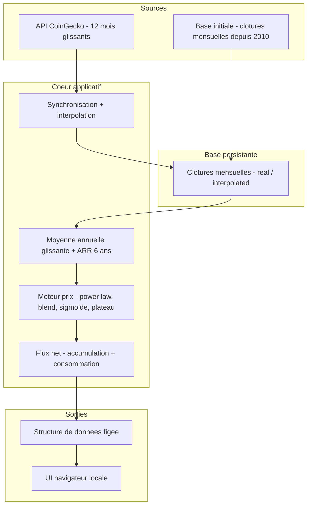

# Cadrage — Bitcoin Retirement Forecast (application Python)

**Version :** v2.1
**Date :** 3 juin 2026
**Documents liés :** Spécification fonctionnelle de l'existant v1.0 (référence du **moteur de prix**) ; `Bitcoin_Subsidy.ods` (référence de la **mécanique de flux** : DCA, croissance, inflation, coût de la vie, stack, portefeuille)
**Statut :** Prêt pour validation
**Évolution v2.1 :** intégration des décisions de la séance de cadrage B3. Trois reversals de périmètre actés (chevauchement DCA/consommation autorisé ; croissance du DCA autorisée ; modèle de flux net) ; ajout du référentiel de calcul à deux têtes (DEC-SOURCES-01) ; formalisation de la catégorie « constantes d'intégrité Bear » incluant le plateau figé et le mode de convergence calendaire.

---

## 1. Objectif

Migrer le modèle de projection de retraite Bitcoin, aujourd'hui implémenté dans un tableur (`forecast_bear_final.ods`) couplé à un dashboard HTML, vers une application web locale Python autonome, open source et publiée sur GitHub sous licence MIT. L'application maintient une base de données persistante de clôtures mensuelles BTC/USD, se synchronise au lancement depuis CoinGecko pour enrichir l'année glissante, recalcule la dynamique d'appréciation sur une fenêtre de cycle et demi (6 ans), et projette la viabilité d'une retraite financée en Bitcoin sur l'horizon 2072 — combinant un **flux d'accumulation (DCA)** et un **flux de consommation (drawdown)**, indépendants et pouvant se chevaucher.

---

## 2. Périmètre V1

### 2.1 Dans le périmètre

- Base de données persistante de clôtures mensuelles BTC/USD, démarrée avec l'historique depuis 2010, auto-alimentée à chaque lancement.
- Synchronisation au lancement du cours et des clôtures mensuelles de l'année glissante depuis l'API CoinGecko (plan gratuit).
- Interpolation linéaire automatique des trous de données mensuelles.
- Moteur de projection reprenant fidèlement les règles de calcul de la spécification fonctionnelle existante (loi de puissance, blend, discount Bear, sigmoïde vers plateau).
- Moyenne mobile d'ancrage figée à 6 ans, calée sur les dernières données synchronisées.
- **Deux flux indépendants** sommés en flux net annuel : accumulation (DCA, mensuel, avec croissance annuelle libre) et consommation (drawdown). Les deux peuvent **se chevaucher** la même année.
- **Croissance annuelle du montant DCA** (taux libre, distinct de la croissance des dépenses).
- Persistance automatique des paramètres entre sessions.
- Interface web locale (backend Python léger + UI navigateur).
- Publication GitHub sous licence MIT avec mise à jour annuelle de la base de référence.

### 2.2 Hors périmètre V1

- Multi-scénarios simultanés (Bull / Base / Bear assumé) — la V1 conserve le seul scénario Bear modéré. `[V2]`
- Import manuel de données de prix par l'utilisateur (état `user`) — écarté pour préserver l'intégrité du modèle (voir §6). `[V2]`
- Récupération automatique de l'historique long via API payante CoinGecko.
- Calcul de fiscalité (CTO, PFU, W-8BEN) ou de plus-values de cession.
- Gestion multi-actifs ou multi-profils.
- Fenêtre de moyenne mobile paramétrable.
- Niveau et année du plateau exposés en réglage utilisateur (ce sont des constantes d'intégrité, ajustables par release uniquement — voir §6).
- Streaming temps réel / WebSocket.

> **Reversals actés en v2.1 (sortis du hors-périmètre v2.0) :** « Coexistence DCA + drawdown la même année » et « Croissance du montant DCA dans le temps » entrent désormais **dans** le périmètre.

---

## 3. Contraintes

### 3.1 Contraintes techniques

**API CoinGecko — plan gratuit (Demo)** — *vérifié au 1 juin 2026*

| Caractéristique | Valeur plan gratuit |
|---|---|
| Rate limit | ~30 calls/min (clé Demo) ; 5-15 sans clé |
| Quota mensuel | 10 000 appels |
| Profondeur historique | **365 jours uniquement** |
| Granularité | journalière et horaire (1 an) |
| Cache | réponse identique = pas de crédit décompté |
| Historique long (depuis 2014) | plans payants uniquement (≥ 35 $/mois) |

**Conséquence structurante :** l'API gratuite ne donne accès qu'aux 365 derniers jours. L'historique long est donc constitué une fois lors de la construction (clôtures mensuelles depuis 2010) et **persisté en base**. CoinGecko n'alimente ensuite que la fenêtre récente (12 derniers mois glissants). La base s'auto-enrichit et devient progressivement indépendante de la limite des 365 jours.

**Autres contraintes techniques**
- Langage : Python (version cible à définir en spec technique).
- Architecture : backend léger servant une UI dans le navigateur (pattern type Flask/FastAPI + front HTML/JS).
- Fonctionnement sans clé API obligatoire (mode dégradé), clé Demo recommandée pour la stabilité.
- Résilience hors-ligne : si la synchronisation échoue, l'application fonctionne sur la base persistée.
- La base et la configuration sont gérées par l'application, non exposées comme fichiers à éditer manuellement.
- **Convention de langue** : code, noms de champs, libellés UI et logs en **anglais** ; prose des specs en **français**.

### 3.2 Contraintes métier / légales

- **Licence MIT** : toute dépendance doit être compatible MIT.
- **Attribution CoinGecko** : le plan gratuit impose une attribution visible de la source.
- **Conditions d'usage CoinGecko** : pas de revente ni de sous-licence des données.
- Aucune donnée personnelle ne transite : outil de calcul local.

---

## 4. Philosophie et principes directeurs

- **Le réel prime sur le théorique.** Dès qu'une clôture mensuelle réelle est disponible, elle remplace toute valeur interpolée. Le modèle théorique ne projette que le futur non observé.
- **Hiérarchie de fiabilité stricte des données.** `real` (clôture API ou base publiée) prime toujours sur `interpolated` (valeur calculée). Une valeur réelle n'est jamais écrasée par une interpolation.
- **Fidélité aux modèles validés.** Les formules de calcul sont réimplémentées à l'identique, vérifiables au cent près contre leurs fichiers de référence respectifs (voir §6, DEC-SOURCES-01).
- **Intégrité du scénario Bear.** Les constantes qui définissent le scénario ne sont pas des réglages utilisateur. Elles garantissent que le modèle reste discipliné et ne peut être rendu artificiellement optimiste. La liste figée — *constantes d'intégrité Bear* — couvre : exposant loi de puissance (5,7675), discount Bear (×0,60), fenêtre de blend (6 ans), fenêtre MM6 (6 ARR annuels), niveau de plateau (3 %), année du plateau (2055), mode de convergence sigmoïde (calendaire). Ces valeurs ne sont ajustables que **par release annuelle**, jamais par l'utilisateur.
- **Honnêteté sur l'incertitude.** L'application distingue visuellement réel et interpolé, affiche la date de dernière synchronisation et signale les trous comblés.
- **Réactivité maîtrisée.** Le modèle utilise des années glissantes (réactif) mais n'intègre que des mois clos (lissé). Il assume d'être non-déterministe dans le temps — c'est un objectif de la migration, pas un défaut.
- **Découplage moteur / présentation.** Le moteur produit une structure de données stable, indépendante de l'affichage.
- **Dégradation gracieuse.** Une panne réseau n'interrompt jamais le calcul.
- **Méthodologie de prix unique.** Une seule définition du prix mensuel (clôture de fin de mois) appliquée à toute la série, de 2010 à aujourd'hui.

---

## 5. Architecture macro

**Responsabilités des blocs**

| Bloc | Responsabilité |
|---|---|
| Synchronisation | Appeler CoinGecko au lancement, récupérer les clôtures mensuelles de l'année glissante (mois clos uniquement), interpoler les trous, persister en base avec flag `real`/`interpolated`, gérer rate limit / cache / échec réseau |
| Base persistante | Stocker durablement les clôtures mensuelles et leur origine ; servir de source unique au calcul |
| Agrégation | Calculer la moyenne annuelle glissante à la volée et l'ARR glissant sur fenêtre 6 ans ; fournir le point d'ancrage |
| Moteur de prix | Produire le prix nominal annuel projeté (ARR théorique : loi de puissance, blend, discount, sigmoïde vers plateau) |
| Flux net | Accumulation (DCA + croissance) et consommation (drawdown) sommées en flux net annuel ; stack, portefeuille, runway ; consomme le prix nominal du moteur |
| Structure de sortie | Exposer un jeu de données figé indépendant de l'affichage |
| UI navigateur | KPI, graphiques, tableaux ; affichage réel vs interpolé, date de synchro, trous |

> **Point de jointure unique entre référentiels :** le moteur de prix (réf. REF v1.0) produit le **prix nominal annuel**, seule grandeur consommée par le bloc Flux net (réf. `Bitcoin_Subsidy.ods`).

---

## 6. Décisions structurantes

| Décision | Justification | Alternatives écartées |
|---|---|---|
| Base persistante auto-alimentée | API gratuite limitée à 365 j ; la base s'enrichit et devient autonome | Historique figé non évolutif |
| Granularité clôtures mensuelles | Compromis volume/précision : ~12 points/an, méthodologie unique | Journalier (volume ×30) ; annuel (perte de granularité) |
| Mois en cours ignoré tant que non clos | Plus simple, et lisse les pumps/crashs intra-mois | Inclure mois partiel ; biaise la moyenne |
| Années glissantes (12 mois clos) | Réactivité accrue, colle au réel | Années calendaires ; moins réactives |
| Modèle non-déterministe dans le temps | Objectif assumé de la migration | Modèle figé |
| Interpolation linéaire de tous les trous | Garde le modèle fonctionnel entre deux lancements espacés | Refus ; figeage ; best-effort à seuil |
| Deux états : `real` / `interpolated` | `real` prime toujours ; pas de donnée non vérifiée injectable | État `user` + import : risque d'injection |
| Mise à jour base par publication GitHub annuelle | Source de vérité partagée, comble les trous proprement | Import manuel utilisateur |
| Fenêtre MM figée à 6 ans | Capture un cycle et demi ; plus stable et prudent ; non ajustable pour préserver l'intégrité Bear | 4 ans (demi-phase) ; paramétrable |
| **DEC-DCA-01 — Deux flux indépendants, chevauchement autorisé** | Modèle de flux net (`stack = Σ entrées − Σ sorties`) ; plus souple ; déjà éprouvé dans `Bitcoin_Subsidy.ods` ; l'utilisateur paramètre librement | Phases DCA → drawdown strictement séquentielles (v2.0) |
| **DEC-DCA-02 — Croissance du DCA autorisée** | Taux annuel libre `dca_growth_rate`, indépendant de la croissance des dépenses ; équilibre l'asymétrie DCA/dépenses | DCA à montant figé (v2.0) |
| DCA mensuel, agrégé à l'année, converti au prix nominal | Forecast projeté annuellement ; conversion `dca_annuel / prix_nominal` (réf. Subsidy) | DCA précis mensuel intra-année |
| **DEC-DCA-03 — Inflation composée dans la dépense** | Le coût de la vie consommé compose inflation et croissance : `cdv_train = base × (1+inflation)^C × (1+spending_growth)^C` ; inflation = hausse de base, croissance = supplément réel de train de vie. Fidèle à Subsidy | Inflation purement informative (REF v1.0) |
| Post-épuisement : projection en négatif | Visualise l'ampleur du déficit (comportement vérifié dans Subsidy) | Arrêt à l'épuisement |
| Scénario unique Bear modéré en V1 | Conforme à la version validée | Multi-scénarios (V2) |
| **Plateau figé (3 % / 2055), non paramétrable** | Constante d'intégrité Bear ; empêche de rendre le modèle artificiellement optimiste ; affinable par release | Plateau exposé en réglage utilisateur (existant REF) |
| **DEC-MOTEUR-01 — Convergence sigmoïde calendaire (option B)** | Le midpoint de la sigmoïde est ancré sur l'origine calendaire du modèle, indépendant de la date de lancement ; évite la compression/falaise des lancements tardifs et la division par zéro post-2054 ; plus robuste et plus discipliné | Re-ancrage glissant (option A : `2026 → anchor_year+1`), conséquence littérale mais non maîtrisée du `2026` codé en dur |
| **DEC-SOURCES-01 — Référentiel de calcul à deux têtes** | REF v1.0 fait foi pour le **moteur de prix** ; `Bitcoin_Subsidy.ods` fait foi pour la **mécanique de flux** (DCA, croissance, inflation, coût de la vie, stack, portefeuille). Jointure unique = prix nominal annuel | Source unique (REF v1.0 ne couvre pas le DCA) |
| App web locale (backend Python + UI navigateur) | Réutilise le dashboard existant ; idéal pour les graphiques | CLI pur ; desktop natif |
| Persistance auto des paramètres | User-friendly, pas de chargement manuel | Chargement manuel à chaque lancement |
| Licence MIT | Publication open source permissive | GPL, propriétaire |

---

## 7. Risques identifiés

| Risque | Niveau | Mitigation |
|---|---|---|
| Dérive entre le moteur de prix Python et REF v1.0 | **Haut** | Suite de tests comparant les sorties Python aux valeurs de REF, au cent près |
| Dérive entre la mécanique de flux Python et `Bitcoin_Subsidy.ods` | **Haut** | Suite de tests dédiée régressant les flux (DCA, dépenses, stack, portefeuille) contre les vecteurs Subsidy (ex. profils Yoan, Charles) |
| Constitution fiable de l'historique mensuel 2010-2025 lors de la construction | **Haut** | Sourcer et vérifier les clôtures mensuelles en phase de construction ; jeux de test dédiés |
| Inflation dans les dépenses : modèle de coût de la vie | Faible | **Tranché (DEC-DCA-03)** : modèle Subsidy retenu — `cdv_train` compose inflation × croissance des dépenses. Modèle REF (inflation informative) écarté |
| Raccord du `2026` codé en dur de la sigmoïde vers un ancrage dynamique | Moyen | Tranché DEC-MOTEUR-01 (option B) ; non-régression au point fixe `anchor_year = 2025` |
| Trous de données entre deux lancements très espacés (> 13 mois) | Moyen | Interpolation linéaire de tous les trous bornés ; affichage explicite |
| Changement futur des conditions de l'API CoinGecko | Moyen | Abstraire la source derrière une interface remplaçable |
| Runway ambigu en présence de chevauchement (stack non monotone) | Faible | Définition retenue : 1ʳᵉ année où stack < 0 (réf. Subsidy) ; caveat documenté en spec Flux |
| Cohérence visuelle réel / interpolé dans l'UI | Faible | Prévu dès la conception |
| Attribution CoinGecko oubliée | Faible | Intégrer l'attribution dès la conception de l'UI |

---

## 8. Glossaire

| Terme | Définition |
|---|---|
| **DCA** | *Dollar Cost Averaging* — accumulation périodique en BTC ; en V1, mensuelle, agrégée à l'année, avec croissance annuelle libre |
| **Drawdown** | Flux de consommation du capital BTC ; **peut coexister** avec l'accumulation la même année (modèle de flux net) |
| **Flux net** | `stack(année) = Σ entrées (DCA + stack initial) − Σ sorties (dépenses)` ; cumul autorisant le chevauchement |
| **Fenêtre glissante** | Période mobile de 6 ans pour la moyenne d'ancrage de l'ARR, recalée à chaque synchronisation |
| **Clôture mensuelle** | Prix du BTC en fin de mois civil ; unité de stockage de la base |
| **Mois clos** | Mois civil terminé ; seuls les mois clos entrent dans les calculs |
| **ARR** | *Annual Rate of Return* — taux de croissance annuel du prix BTC |
| **ARR glissant** | moyenne(12 derniers mois clos) / moyenne(12 mois clos précédents) − 1 ; nécessite 24 mois |
| **Loi de puissance** | Modèle `prix = a × t^b`, exposant 5,7675, origine du temps 2008 |
| **Plateau** | Niveau d'ARR asymptotique long terme (3 %), atteint vers l'année plateau (2055) ; figé |
| **Mode de convergence** | Calage temporel de la sigmoïde vers le plateau : calendaire (option B, V1) vs glissant (option A) |
| **Constantes d'intégrité Bear** | Paramètres de code, ajustables par release uniquement, jamais exposés à l'utilisateur (exposant, discount, blend, MM6, plateau, année plateau, mode de convergence) |
| **`real` / `interpolated`** | Origine d'une clôture mensuelle : réelle vs interpolée |
| **Base persistante** | Stockage local durable des clôtures mensuelles, auto-alimenté |
| **Mode dégradé** | Fonctionnement sur la base persistée en cas d'échec de synchronisation |
| **Non-déterministe dans le temps** | Propriété assumée : la projection évolue selon la date de lancement |
| **Compteur d'années `C`** | `C = année − anchor_year` ; 0 à l'ancre, 1 à la 1ʳᵉ année projetée (équivalent du `N` de REF) |

---

## 9. Questions résiduelles

- [ ] Format de la base persistante (SQLite, fichier structuré) → spec technique
- [ ] Version de Python et stack web (Flask / FastAPI / autre) → spec technique
- [ ] Horizon de projection : 2072 (cadrage) vs 2100 (observé dans Subsidy) → à confirmer ; sans incidence sur la mécanique
- [ ] Stratégie de sourcing des clôtures mensuelles 2010-2025 pour la base initiale → phase de construction

---

## 10. Décisions validées en séance

- ✅ Base persistante auto-alimentée, clôtures mensuelles depuis 2010
- ✅ Mois en cours ignoré tant que non clos ; fenêtre = 12 mois clos
- ✅ Années glissantes, modèle non-déterministe assumé
- ✅ Interpolation linéaire de tous les trous, deux états `real`/`interpolated`
- ✅ Abandon de l'état `user` et de l'import manuel ; mise à jour par publication GitHub annuelle
- ✅ Fenêtre MM figée à 6 ans, non paramétrable
- ✅ **Plateau figé 3 % / 2055, non paramétrable** (constante d'intégrité Bear)
- ✅ **DEC-MOTEUR-01 — convergence sigmoïde calendaire (option B)** en V1, ajustable par release
- ✅ **DEC-DCA-01 — deux flux indépendants, chevauchement autorisé** (modèle de flux net)
- ✅ **DEC-DCA-02 — croissance du DCA autorisée** (taux libre, distinct des dépenses)
- ✅ DCA mensuel agrégé à l'année, converti au prix nominal de l'année
- ✅ **DEC-DCA-03 — inflation composée dans la dépense** (modèle Subsidy)
- ✅ Post-épuisement : projection continue en négatif
- ✅ **DEC-SOURCES-01 — référentiel à deux têtes** (REF = moteur de prix ; Subsidy = flux)
- ✅ App web locale Python (backend léger + UI navigateur)
- ✅ Persistance automatique des paramètres
- ✅ Licence MIT, publication GitHub

---

*Document de cadrage v2.1. Tous les points de la séance B3 sont tranchés, y compris le rôle de l'inflation dans les dépenses (DEC-DCA-03, modèle Subsidy).*
