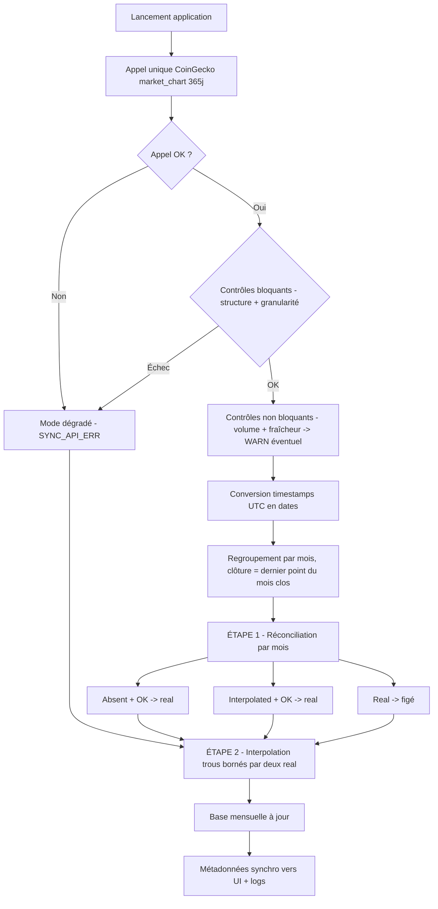
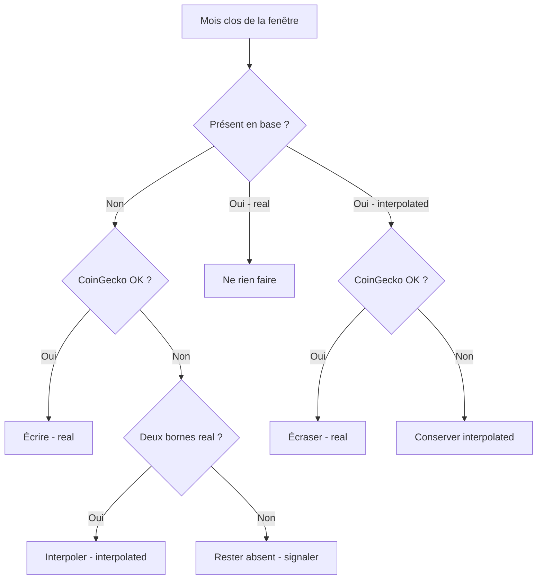

# Spécification fonctionnelle — Module Synchronisation

**Projet :** Bitcoin Retirement Forecast (application Python)
**Bloc :** Module Synchronisation (récupération, dérivation des clôtures mensuelles, interpolation, persistance)
**Version :** v1.3
**Date :** 1 juin 2026
**Documents parents :** Cadrage v2.0 ; Spécification fonctionnelle de l'existant v1.0
**Statut :** Prêt pour validation
**Convention de langue :** les messages UI, messages de logs, codes de statut et noms de champs techniques sont rédigés en **anglais** (codebase open source) ; la prose explicative de la spec reste en **français**.
**Évolution v1.3 :** traduction en anglais de tous les messages UI, logs et noms de champs techniques (`month`, `price`, `origin`, `updated_at`, `last_sync_date`, `sync_status`, `interpolated_months`, `missing_months`).

---

## 1. Objectifs du bloc

- **Récupérer** au lancement de l'application les données de prix journalières du Bitcoin sur la fenêtre glissante des 12 derniers mois via l'API CoinGecko gratuite.
- **Dériver** les clôtures mensuelles à partir des points journaliers reçus, par regroupement par mois civil.
- **Réconcilier** ces clôtures avec la base persistante selon une hiérarchie de fiabilité stricte (`real` prime sur `interpolated`).
- **Interpoler** linéairement les clôtures mensuelles manquantes une fois les récupérations terminées, à condition de disposer de deux bornes réelles.
- **Persister** durablement chaque clôture mensuelle avec son origine (`origin` = `real` / `interpolated`).
- **Signaler** à l'utilisateur l'état de la synchronisation : date de dernière mise à jour, échec éventuel, mois interpolés.

---

## 2. Périmètre

### 2.1 Ce que ce bloc fait

Le module gère l'intégralité de la chaîne d'acquisition des données de prix : un appel unique à CoinGecko au démarrage, le découpage des points journaliers en clôtures mensuelles, la mise à jour de la base selon les règles de réconciliation, et l'interpolation des trous résiduels. Il produit une base mensuelle propre et continue qui sert de source unique au module d'agrégation.

### 2.2 Ce que ce bloc ne fait pas

Le module ne calcule pas la moyenne annuelle glissante ni l'ARR (module Agrégation). Il ne constitue pas l'historique long initial 2010-2025, qui est fourni à la construction comme jeu de données figé (dépendance externe, voir §3). Il n'affiche pas le prix live instantané (écarté au cadrage). Il ne récupère pas de données au-delà des 365 jours offerts par le plan gratuit. Il ne gère aucun import manuel de données utilisateur (écarté au cadrage).

---

## 3. Données en entrée

### 3.1 Réponse API CoinGecko

**Endpoint utilisé :** `GET /coins/bitcoin/market_chart?vs_currency=usd&days=365`

Sans clé API (mode dégradé) ou avec clé Demo (recommandé, rate limit stable ~30/min). Un **seul appel** par synchronisation.

**Format de réponse** (extrait) :

```json
{
  "prices": [
    [1704067200000, 42261.04],
    [1704153600000, 42493.27]
  ],
  "market_caps": [ ... ],
  "total_volumes": [ ... ]
}
```

Seul le tableau `prices` est exploité. Chaque élément est une paire `[timestamp_unix_ms, prix_usd]`. **Avec notre appel fixe `days=365`, la granularité retournée est toujours journalière** (un point par jour à 00:00 UTC), soit environ 365 points : 365 dépasse le seuil de 90 jours au-delà duquel CoinGecko bascule systématiquement en granularité journalière. L'application n'a donc jamais à gérer de granularité horaire ou 5-minutes — le régime journalier est constant. *Vérifié empiriquement le 1 juin 2026.*

### 3.2 Base persistante (état antérieur)

Chaque enregistrement de clôture mensuelle comporte au minimum :

| Champ | Type | Description |
|---|---|---|
| `month` | identifiant année-mois (AAAA-MM) | clé du mois civil |
| `price` | décimal | clôture mensuelle en USD |
| `origin` | énuméré | `real` ou `interpolated` |
| `updated_at` | horodatage | date de dernière écriture de l'enregistrement |

### 3.3 Données de construction (dépendance externe)

L'historique long mensuel depuis 2010 est fourni à la première construction de la base sous forme de jeu figé, sourcé hors application. Toutes ces clôtures sont marquées `real` à l'initialisation.

---

## 4. Règles fonctionnelles

### 4.1 Déclenchement de la synchronisation

La synchronisation se déclenche **systématiquement à chaque lancement** de l'application, sans throttle ni cache applicatif. Le coût est d'un appel CoinGecko par lancement, ce qui reste négligeable au regard du quota gratuit.

### 4.2 Format des données reçues et conversion

Chaque point du tableau `prices` est une paire `[timestamp, prix]` où le timestamp est un **entier Unix en millisecondes, en UTC** (exemple : `1749081600000` correspond au 5 juin 2025 à 00:00 UTC). Ce n'est ni une date lisible ni un quantième : c'est le nombre de millisecondes écoulées depuis le 1ᵉʳ janvier 1970 UTC.

La conversion en date se fait via la bibliothèque standard, sans aucun calcul de calendrier :

```
date_utc = conversion_timestamp(timestamp / 1000, fuseau = UTC)
# Python : datetime.fromtimestamp(ts/1000, tz=timezone.utc)
```

La date obtenue porte nativement année, mois et jour — y compris les 29 février, gérés automatiquement par la conversion. Aucune manipulation de l'entier brut n'est nécessaire pour déterminer le mois.

### 4.3 Validation de la réponse API et criticité

La réponse reçue est soumise à quatre contrôles, répartis en **deux niveaux de criticité**. Le critère de succès de la synchronisation n'est pas le volume brut de points, mais **la dérivabilité des clôtures mensuelles des mois clos attendus** : tant que les clôtures nécessaires peuvent être dérivées, la synchronisation réussit, même si certains contrôles non bloquants émettent un avertissement.

**Contrôles BLOQUANTS** — en cas d'échec, la réponse est rejetée, on bascule en mode dégradé (règle 4.9) et on conserve la base existante :

| Contrôle | Règle | Détecte |
|---|---|---|
| Structure | `prices` existe, est une liste non vide, et son premier élément est une paire `[nombre, nombre]` | Changement de schéma API, réponse corrompue ou illisible |
| Granularité | **écart médian** entre timestamps consécutifs ≈ 24 h (86 400 000 ms, tolérance ±10 %) | Données horaires, hebdomadaires ou toute granularité non journalière rendant le découpage mensuel faux. Contrôle déterminant, insensible aux bissextiles |

**Contrôles NON BLOQUANTS** — en cas d'écart, on émet un avertissement (UI + log) mais **on poursuit** le traitement tant que les clôtures mensuelles closes restent dérivables :

| Contrôle | Règle | Détecte | Comportement |
|---|---|---|---|
| Volume | nombre de points entre **360 et 370** | Réponse légèrement tronquée ou élargie | Avertissement ; on dérive les clôtures disponibles, les mois sans point partent en interpolation (étape 2) |
| Fraîcheur | point le plus récent daté de **moins de 6 jours** par rapport à la date machine UTC | Source légèrement en retard | Avertissement ; cohérent avec la tolérance du volume. Sans incidence si les mois clos sont dérivables (le dernier mois clos est complet par définition) |

> **Justification de la criticité.** Seuls la structure (sans données exploitables, rien n'est possible) et la granularité (un découpage mensuel sur des données non journalières serait faux) compromettent l'intégrité du résultat. Le volume et la fraîcheur sont des indicateurs de qualité : un volume de 358 points ou des données vieilles de 4 jours n'empêchent pas de dériver correctement les 12 clôtures mensuelles closes. On ne jette pas une synchronisation exploitable pour un écart mineur.

**Messages par type de défaut** — chaque contrôle produit un message distinct, à deux destinations : un message **UI** court et non technique, et un message **log** technique horodaté avec valeurs observées vs attendues :

| Défaut | Niveau | Message UI | Message log |
|---|---|---|---|
| Structure illisible | ERR (bloquant) | "Unreadable CoinGecko data — using existing data" | `SYNC_STRUCT_ERR: 'prices' field missing or unexpected format — received: <type/excerpt>` |
| Granularité non journalière | ERR (bloquant) | "Inconsistent CoinGecko data — using existing data" | `SYNC_GRANULARITY_ERR: median interval = <X>h, expected ~24h` |
| Volume hors plage | WARN (non bloquant) | "Partial sync — using available data" (notification éphémère, voir 6.2) | `SYNC_VOLUME_WARN: <N> points received, expected 360-370 — continuing` |
| Fraîcheur dégradée | WARN (non bloquant) | "CoinGecko data slightly delayed" (notification éphémère, voir 6.2) | `SYNC_STALE_WARN: latest point dated <date>, i.e. <N> days old — continuing` |
| Appel API KO | ERR (bloquant) | "CoinGecko sync unavailable — using existing data" | `SYNC_API_ERR: <HTTP code / network exception>` |


### 4.4 Définition de la clôture mensuelle

La clôture mensuelle d'un mois civil est **le dernier point journalier disponible de ce mois** dans la réponse CoinGecko. Cette définition unique s'applique à toute la série.

```
clôtures = {}
pour chaque point (timestamp, prix) dans prices :
    date = conversion_timestamp(timestamp / 1000, UTC)
    clé = (date.année, date.mois)          # ex : (2025, 6)
    si clé absente OU date > date_stockée_pour_clé :
        clôtures[clé] = (date, prix)
# en fin de boucle, clôtures[clé] contient le dernier point de chaque mois
```

Le regroupement s'appuie uniquement sur la clé (année, mois) extraite de la date convertie. Aucun calcul de calendrier (nombre de jours par mois, années bissextiles) n'est nécessaire : le programme n'a jamais à déterminer quel est le dernier jour d'un mois, il prend simplement le dernier point que la source a fourni pour ce mois.

### 4.5 Définition d'un mois clos

Un mois civil est **clos** dès lors que la date courante (en UTC) appartient à un mois civil postérieur.

```
mois_clos(M) = (année-mois courant UTC) > M
```

Exemple : au 1er juin, mai est clos, juin ne l'est pas. **Seuls les mois clos** entrent dans la base et les calculs. Le mois en cours est systématiquement ignoré, même si des points journaliers existent pour lui. La date courante et les timestamps étant tous deux en UTC, aucun décalage de fuseau ne peut survenir.

### 4.6 Fenêtre de synchronisation

La fenêtre traitée est constituée des **12 derniers mois clos** précédant la date courante.

### 4.7 Réconciliation — étape 1 : récupération

Pour chaque mois clos de la fenêtre des 12 derniers mois, la règle de mise à jour de la base est :

```
si le mois est ABSENT de la base
    et appel CoinGecko OK et clôture dérivable
        → écrire la clôture, origin = real
si le mois est présent en INTERPOLATED
    et appel CoinGecko OK et clôture dérivable
        → écraser la clôture, origin = real
si le mois est présent en REAL
        → ne rien faire (valeur figée définitivement)
```

> Le cas « mois absent ET appel CoinGecko KO » n'est pas traité ici : il relève de l'étape 2 (interpolation), une fois toutes les récupérations possibles effectuées.

### 4.8 Réconciliation — étape 2 : interpolation des trous résiduels

Une fois **toutes** les récupérations de l'étape 1 effectuées, les mois encore absents sont comblés par interpolation linéaire, à condition d'être bornés des deux côtés par des valeurs **`real`**.

```
pour chaque séquence de mois absents bornée par
    mois_réel_A (valeur V_A, real) et mois_réel_B (valeur V_B, real), séparés de N mois :
    pour le k-ième mois absent (k = 1 .. N−1) :
        valeur = V_A + (V_B − V_A) × k / N
        écrire la valeur, origin = interpolated

si un mois absent n'a pas deux bornes RÉELLES
    → rester absent, signaler
```

L'interpolation porte **exclusivement sur le prix mensuel**, jamais sur l'ARR. La séquence en deux étapes (récupérer tout, puis interpoler) garantit qu'on n'interpole jamais contre une borne qui aurait pu être récupérée.

> **Pourquoi des bornes `real` uniquement.** Une zone interpolée est, par construction, toujours encadrée de deux valeurs `real` (ce sont elles qui ont permis de l'interpoler). Il ne peut donc jamais exister deux bornes `interpolated` consécutives autour d'un trou, ni une borne `interpolated` isolée côtoyant un trou : la zone aurait été comblée en entier d'un bloc. Si un trou ne dispose pas de deux bornes `real` — typiquement quand la synchronisation échoue de façon répétée et que le trou s'étend dans le temps sans nouvelle donnée réelle — il n'y a tout simplement **rien à interpoler de fiable** : le mois reste `absent` et signalé. Cette règle garantit que toute valeur interpolée s'ancre, des deux côtés, sur des prix réellement observés, et que le modèle ne tourne jamais sur ses propres approximations.

### 4.9 Échec de synchronisation

Si l'appel CoinGecko échoue (réseau indisponible, API en erreur, rate limit dépassé) ou si la réponse est rejetée par la validation (règle 4.3) :

```
ne pas réessayer automatiquement
afficher le message UI : "CoinGecko sync unavailable — using existing data"
poursuivre avec la base persistée en l'état
appliquer néanmoins l'étape 2 (interpolation) sur les trous bornables par deux real
```

L'application reste pleinement fonctionnelle en mode dégradé.

### 4.10 Initialisation de la base (premier lancement)

Au tout premier lancement, la base est amorcée avec le jeu de données historique mensuel figé (depuis 2010), toutes clôtures marquées `real`. La synchronisation enrichit ensuite la fenêtre récente selon les règles ci-dessus.

---

## 5. Cas de rejet et comportements limites

**Rappel — hiérarchie de fiabilité :** `real` prime toujours sur `interpolated`. Une valeur `real` n'est jamais écrasée, ni par une récupération ultérieure, ni par une interpolation. Une valeur `interpolated` est écrasée dès qu'une `real` devient disponible pour le même mois.

| Motif | Condition | Comportement |
|---|---|---|
| Mois en cours | mois non clos | Ignoré, jamais stocké ni calculé |
| Valeur `real` existante | mois déjà en base en `real` | Aucune écriture, valeur figée |
| Appel API KO | réseau / API / rate limit | **Bloquant** : mode dégradé, message, pas de retry |
| Structure illisible | `prices` absent ou format inattendu | **Bloquant** : réponse rejetée, mode dégradé, log `SYNC_STRUCT_ERR` |
| Granularité non journalière | écart médian entre points ≠ ~24 h | **Bloquant** : réponse rejetée, mode dégradé, log `SYNC_GRANULARITY_ERR` |
| Volume hors plage | nombre de points < 360 ou > 370 | **Non bloquant** : avertissement, poursuite si clôtures dérivables, log `SYNC_VOLUME_WARN` |
| Données légèrement en retard | point le plus récent entre 1 et 6 jours | **Non bloquant** : avertissement, poursuite, log `SYNC_STALE_WARN` |
| Trou bornable (par deux `real`) | mois absent encadré de deux valeurs réelles | Interpolé en étape 2, `origin = interpolated` |
| Trou non bornable | mois absent sans deux bornes `real` | Reste absent, signalé |
| Clôture non dérivable | aucun point journalier pour un mois clos de la fenêtre | Traité comme mois absent → interpolation si bornable par deux `real` |

---

## 6. Données en sortie

### 6.1 Base mensuelle mise à jour

La sortie principale est la base persistante actualisée : une série continue de clôtures mensuelles de 2010 au dernier mois clos, chacune marquée `real` ou `interpolated`. Cette base est la **source unique** du module Agrégation.

### 6.2 Métadonnées de synchronisation

À destination de l'interface et des logs :

| Donnée | Description | Persistance |
|---|---|---|
| `last_sync_date` | horodatage de la dernière synchronisation réussie | **Stockée en base** (une seule valeur) |
| `sync_status` | résultat détaillé de la dernière synchro (voir ci-dessous) | Recalculé à chaque lancement |
| `interpolated_months` | liste des mois en `interpolated` | **Déduite** du champ `origin` (requête, pas de stockage redondant) |
| `missing_months` | liste des mois non comblés (trous non bornables) | **Déduite** de l'absence en base sur la fenêtre attendue |

**Détail de `sync_status`.** Le statut n'est pas un simple succès/échec binaire : il reflète le type de défaut rencontré, cohérent avec la criticité de la règle 4.3. Chaque valeur a une trace dans les logs système.

| Valeur statut | Signification | Trace log |
|---|---|---|
| `OK` | Synchronisation réussie, aucun avertissement | `SYNC_OK: <N> months processed, <date>` |
| `OK_WARN_VOLUME` | Réussie avec volume hors plage | `SYNC_VOLUME_WARN` |
| `OK_WARN_STALE` | Réussie avec données légèrement en retard | `SYNC_STALE_WARN` |
| `DEGRADED_API` | Échec appel API, base existante conservée | `SYNC_API_ERR` |
| `DEGRADED_STRUCT` | Réponse illisible, base existante conservée | `SYNC_STRUCT_ERR` |
| `DEGRADED_GRANULARITY` | Granularité non journalière, base existante conservée | `SYNC_GRANULARITY_ERR` |

**Affichage des avertissements et anomalies.** Les avertissements non bloquants (volume, fraîcheur) et les informations sur les mois interpolés / absents s'affichent dans l'UI sous forme **éphémère et non persistante** — une notification (pastille ou popup transitoire) qui s'efface après consultation, afin de ne pas alourdir durablement l'interface. Le contenu détaillé reste en revanche **systématiquement consigné dans les logs système**, où il est retrouvable a posteriori pour le diagnostic. Les défauts bloquants (mode dégradé) font l'objet d'un message UI plus visible mais également non permanent, doublé d'une entrée log.

---

## 7. Paramètres configurables

| Paramètre | Rôle | Valeur de référence | Remarque |
|---|---|---|---|
| Clé API CoinGecko (Demo) | Stabiliser le rate limit | aucune (optionnelle) | Mode sans clé possible mais rate limit plus bas |
| Devise de référence | Monnaie de cotation | `usd` | Figé en V1 |
| Profondeur de récupération | Fenêtre demandée à l'API | 365 jours | Maximum du plan gratuit |
| Fenêtre de réconciliation | Mois traités par synchro | 12 derniers mois clos | Aligné sur l'année glissante |

---

## 8. Diagrammes

### 8.1 Séquence de synchronisation au lancement



### 8.2 Arbre de décision par mois clos



---

## 9. Questions ouvertes

Aucune question structurante ne reste ouverte sur ce module. Les points résiduels relèvent de la spec technique :

- [ ] **Format de stockage** de la date de dernière synchro et du schéma de la base (SQLite, table, types de champs) → spec technique

### Décisions tranchées en séance

- ✅ **Fuseau horaire** — tout est jugé en **UTC**, aligné sur les timestamps CoinGecko. Aucun décalage possible (règle 4.5).
- ✅ **Détection de granularité** — **vérification active** : structure et granularité bloquantes, volume et fraîcheur non bloquants (règle 4.3).
- ✅ **Seuil de fraîcheur** — 6 jours, cohérent avec la tolérance du contrôle de volume ; non bloquant.
- ✅ **Critère de succès** — dérivabilité des clôtures mensuelles closes, pas le volume brut de points.
- ✅ **Interpolation** — entre deux bornes `real` uniquement ; un trou non bornable par du réel reste absent.
- ✅ **Métadonnées** — `last_sync_date` stockée ; `interpolated_months` / `missing_months` déduits du champ `origin`.
- ✅ **Langue du code** — tous les messages UI, messages de logs, codes de statut et **noms de champs techniques** sont en **anglais** dès la spec (décision prise pour éviter un refactor de traduction en cours de développement). La prose de la spec reste en français.
- ✅ **Affichage** — avertissements et anomalies en notification éphémère dans l'UI, trace permanente dans les logs.

---

## 10. Glossaire

| Terme | Définition |
|---|---|
| **Clôture mensuelle** | Dernier point journalier disponible d'un mois civil clos |
| **Mois clos** | Mois civil terminé (date courante dans un mois postérieur) |
| **Fenêtre glissante** | Les 12 derniers mois clos précédant la date courante |
| **`real`** | Clôture mensuelle réelle, issue de CoinGecko ou de la base de construction |
| **`interpolated`** | Clôture calculée par interpolation linéaire entre deux bornes connues |
| **Réconciliation** | Mise à jour de la base par comparaison entre données récupérées et données existantes |
| **Mode dégradé** | Fonctionnement sur la base persistée en cas d'échec de synchronisation |
| **Borne** | Clôture mensuelle `real` encadrant un trou ; l'interpolation exige deux bornes `real` |
| **market_chart** | Endpoint CoinGecko retournant les points de prix journaliers sur une plage |

---

*Spécification fonctionnelle du module Synchronisation v1.3. À valider avant la spec du module Agrégation.*
