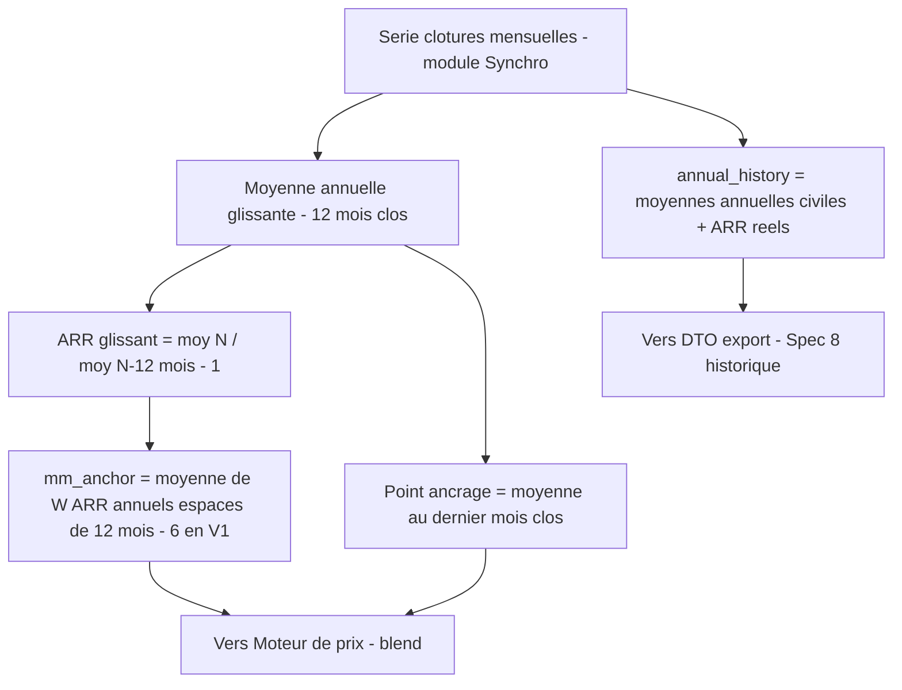
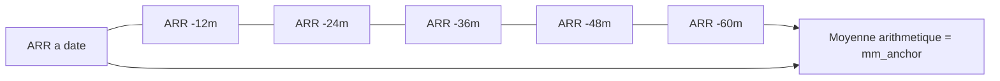

# Spécification fonctionnelle — Module Agrégation

**Projet :** Bitcoin Retirement Forecast (application Python)
**Bloc :** Module Agrégation (moyenne annuelle glissante, ARR glissant, MM d'ancrage, raccord année en cours)
**Version :** v1.3
**Date :** 5 juin 2026
**Documents parents :** Cadrage v2.1 ; Spécification fonctionnelle de l'existant REF v1.0 ; Spécification Synchronisation v1.3 ; Spécification technique 8 — Moteur de calcul v1.0 *(consommateur de `annual_history`)*
**Statut :** Prêt pour validation
**Convention de langue :** messages UI, logs, codes de statut et noms de champs techniques en **anglais** ; prose explicative en **français**.

**Évolution v1.2 :**
1. **Reclassement de la fenêtre MM** — de « figée, non paramétrable » à **constante d'intégrité Bear centralisée (`MM_WINDOW_YEARS`), ajustable par release, jamais exposée à l'utilisateur**. Ce reclassement aligne le document sur le Cadrage v2.1 (les constantes d'intégrité Bear sont « ajustables par release uniquement ») et permet le balayage de la fenêtre (`{4, 6, 8}`) au harnais de test, sans toucher au moteur de prix qui consomme la MM comme scalaire.
2. **Correction de la profondeur de données requise** — elle n'est **pas une constante** mais une **dérivée du paramètre** : `profondeur = (W − 1) × 12 + 24` mois, soit **84 mois (7 ans) pour W = 6**. La v1.1 indiquait 72 par erreur (elle ajoutait un seul lookback de 12 mois au plus ancien ARR au lieu des **24 mois** qu'exige chaque ARR par sa propre définition §4.2). Le 84 de la v1.0 était juste ; la « correction » 84 → 72 de la v1.1 est annulée.
3. **Raccord de nommage** — le champ de sortie `mm6` devient **`mm_anchor`** (agnostique à la taille de fenêtre), pour cohérence avec le Moteur de prix v1.0 qui consomme `mm_anchor`. Idem `mm6_window_start` → `mm_window_start`, log `AGG_MM6` → `AGG_MM_ANCHOR`.

**Évolution v1.3 (additive) :**
4. **Ajout de la sortie diagnostic `annual_history`** — série des moyennes annuelles (par année civile) et ARR réels d'année en année (2010 → `anchor_year`), requise par la Spécification technique 8 (§3.6) pour alimenter l'historique du `ForecastExportDTO`. Changement **strictement additif** : aucun champ, comportement ou nommage existant n'est modifié ; seule une grandeur de sortie supplémentaire est exposée (nouvelles §4.7 et entrée §6.2). Incrément **mineur** (additif, sans changement de périmètre).

---

## 1. Objectifs du bloc

- **Calculer**, à partir des clôtures mensuelles persistées par le module Synchronisation, la moyenne annuelle glissante du prix du Bitcoin.
- **Dériver** l'ARR annuel glissant (taux de croissance d'une année glissante sur la précédente).
- **Produire** la MM d'ancrage (`mm_anchor`) : moyenne des `MM_WINDOW_YEARS` derniers ARR annuels glissants (6 en V1), qui alimente le blend du moteur de projection.
- **Établir** le point d'ancrage de la projection (dernière valeur réelle connue) et le raccord avec l'année en cours.
- **Exposer** la série historique annuelle (`annual_history`) consommée par le tableau d'export (Spec technique 8).
- Le tout **recalculé à chaque lancement**, en cohérence avec le caractère non-déterministe dans le temps du modèle.

---

## 2. Périmètre

### 2.1 Ce que ce bloc fait

Le module transforme la série de clôtures mensuelles (sortie du module Synchronisation) en les grandeurs annuelles qui pilotent la projection : moyenne annuelle glissante, ARR annuel glissant, et MM d'ancrage. Il détermine également le point de départ de la projection et expose la série historique annuelle pour l'affichage.

### 2.2 Ce que ce bloc ne fait pas

Le module ne récupère ni n'interpole les données de prix (module Synchronisation). Il n'applique pas le modèle Bear (loi de puissance, blend, discount, sigmoïde) — il fournit seulement la MM d'ancrage que le moteur consomme. Il ne projette pas le futur (module Moteur de prix). Il ne gère ni le DCA ni le drawdown (module Flux). Il n'assemble pas le DTO d'export (Spec technique 8) — il en fournit seulement la matière historique.

---

## 3. Données en entrée

### 3.1 Série de clôtures mensuelles

Fournie par le module Synchronisation : une série continue de clôtures mensuelles, chacune avec `month`, `price`, `origin` (`real` / `interpolated`). La série couvre de 2010 au dernier mois clos. Pour le module Agrégation, `real` et `interpolated` sont traités de façon identique — l'interpolation a déjà assuré la continuité de la série en amont.

### 3.2 Constantes héritées du modèle

| Constante (EN) | Valeur V1 | Origine / nature |
|---|---|---|
| Fenêtre d'année glissante | 12 mois clos | Cadrage v2.1 — constante d'intégrité Bear |
| `MM_WINDOW_YEARS` — fenêtre MM d'ancrage | 6 ARR annuels glissants | **Constante d'intégrité Bear (Cadrage v2.1) : centralisée en configuration de code, ajustable par release, jamais exposée à l'utilisateur** |

> **Clarification figé vs paramétrable.** « Figé » et « paramétrable » ne sont pas opposés ici : ce sont deux axes distincts. La fenêtre MM est (a) **jamais exposée à l'utilisateur final** — pour préserver l'intégrité du scénario Bear ; (b) **centralisée et modifiable par un développeur en back office**, ajustable par release. C'est exactement la définition d'une constante d'intégrité Bear du Cadrage v2.1. La v1.1 employait « figé » comme raccourci pour « non exposé utilisateur », ce qui prêtait à confusion.

---

## 4. Règles fonctionnelles

### 4.1 Moyenne annuelle glissante

La moyenne annuelle glissante à une date donnée est la **moyenne arithmétique simple** des clôtures mensuelles des 12 derniers mois clos. Aucune pondération (conforme à l'existant, règle 4.2 de REF).

```
moyenne_annuelle_glissante(date) = moyenne_arithmétique(
    clôtures mensuelles des 12 derniers mois clos précédant date )
```

Les 12 mois sont nécessairement disponibles (réels ou interpolés) grâce au module Synchronisation. Si moins de 12 mois clos existent en base (cas théorique au tout début de la série 2010), la moyenne n'est pas calculable pour cette date.

### 4.2 ARR annuel glissant

L'ARR annuel glissant compare la moyenne annuelle glissante actuelle à celle d'il y a 12 mois. Il transpose en mensuel la définition de l'existant (`ARR = prix_moyen(année) / prix_moyen(année−1) − 1`, règle 4.3 de REF).

```
ARR_glissant(date) =
    moyenne_annuelle_glissante(date)
  / moyenne_annuelle_glissante(date − 12 mois)
  − 1
```

Le calcul nécessite **24 mois clos** de données continues (12 pour la fenêtre récente, 12 pour la fenêtre précédente). **Ce chiffre de 24 mois est la brique de base du calcul de profondeur de la MM (§4.3).**

### 4.3 MM d'ancrage (`mm_anchor`)

La MM d'ancrage est la **moyenne arithmétique des `MM_WINDOW_YEARS` derniers ARR annuels glissants** (6 en V1), ces ARR étant espacés de 12 mois et **ne se chevauchant pas** (option lisse). Elle prolonge directement la logique de la MM4 de l'existant (moyenne d'ARR annuels distincts), en élargissant le nombre d'ARR de 4 à 6 pour couvrir plus d'un cycle Bitcoin complet.

```
W = MM_WINDOW_YEARS                                  # 6 en V1
mm_anchor = moyenne_arithmétique(
    ARR_glissant(date),
    ARR_glissant(date − 12 mois),
    ...
    ARR_glissant(date − (W − 1) × 12 mois)
)
```

Pour W = 6 :

```
mm_anchor = moyenne_arithmétique(
    ARR_glissant(date),         ARR_glissant(date − 12 mois),
    ARR_glissant(date − 24 mois), ARR_glissant(date − 36 mois),
    ARR_glissant(date − 48 mois), ARR_glissant(date − 60 mois)
)
```

> **Pourquoi W ARR espacés de 12 mois et non W × 12 ARR mensuels.** L'option retenue (« lisse ») prend des points annuels distincts qui ne se recouvrent pas, fidèle à l'esprit de l'existant où la MM portait sur des ARR d'années civiles distinctes (la MM4 prenait 4 ARR annuels). On élargit simplement le nombre d'ARR de 4 à 6. L'alternative (moyenne de tous les ARR glissants mensuels sur la fenêtre, soit ~60 valeurs chevauchantes) aurait sur-lissé le signal et se serait éloignée du comportement de référence. Pour W = 6, les ARR s'étalent sur 5 ans d'amplitude, couvrant plus d'un cycle Bitcoin complet (~4 ans).

> **Profondeur de données requise — dérivée du paramètre, pas une constante.** L'ARR glissant le plus ancien est à `date − (W − 1) × 12 mois`, et il nécessite lui-même **24 mois** de données avant son terme (sa propre définition §4.2 : 12 mois de fenêtre récente + 12 mois de fenêtre précédente). La profondeur requise est donc :
>
> ```
> profondeur_requise(W) = (W − 1) × 12  +  24   mois
>                         └── étalement ──┘   └─ lookback du plus ancien ARR
> ```
>
> | `MM_WINDOW_YEARS` (W) | Étalement `(W−1)×12` | + lookback ARR | **Profondeur requise** |
> |---|---|---|---|
> | 4 (ancienne MM4) | 36 mois | +24 | **60 mois (5 ans)** |
> | **6 (défaut V1)** | 60 mois | +24 | **84 mois (7 ans)** |
> | 8 (variante test) | 84 mois | +24 | **108 mois (9 ans)** |
>
> Pour W = 6, la MM requiert donc au minimum **84 mois clos (7 ans)** de série continue — et non 72 (erreur v1.1). La base démarrant en 2010, cette profondeur est toujours disponible en pratique.

### 4.4 Point d'ancrage de la projection

Le **point d'ancrage** est la dernière valeur réelle connue à partir de laquelle la projection démarre. Conformément à l'existant (où 2025 sert d'ancrage et la projection démarre en 2026) :

```
anchor_year  = année du dernier mois clos disponible
anchor_price = moyenne_annuelle_glissante(dernier mois clos)
```

La projection annuelle démarre à `anchor_year + 1`. Le prix d'ancrage est le point de départ de la capitalisation du moteur de prix.

### 4.5 Raccord de l'année en cours

L'année en cours est partielle (le mois courant non clos est ignoré, règle 4.5 de la spec Synchronisation). Elle n'est donc **jamais** traitée comme un point projeté : elle constitue le **dernier point d'ancrage réel** avant la projection.

```
l'année en cours partielle n'entre pas dans la projection théorique
sa moyenne annuelle glissante (sur les 12 derniers mois clos) sert de anchor_price
la projection théorique commence à l'année suivante
```

Ainsi, à mesure que les mois clos s'accumulent, le point d'ancrage avance et la projection se recale — c'est le mécanisme qui rend le modèle réactif et non-déterministe dans le temps (objectif assumé au cadrage).

### 4.6 Recalcul systématique

Toutes les grandeurs de ce module (moyenne annuelle glissante, ARR glissant, MM d'ancrage, point d'ancrage, série historique annuelle) sont **recalculées à chaque lancement** de l'application, après la synchronisation. Aucune n'est figée en base : elles se déduisent de la série de clôtures mensuelles à jour.

### 4.7 Série historique annuelle (`annual_history`)

En complément des grandeurs d'ancrage, le module expose la série des **moyennes annuelles (par année civile)** et de leurs **ARR réels** d'année en année, pour la plage historique. Cette série alimente l'affichage historique du tableau d'export (miroir des lignes historiques de `_Export`, consommée par la Spec technique 8 §3.6).

```
pour chaque année civile complète Y de la plage en base (2010 .. anchor_year) :
    annual_avg_price(Y) = moyenne_arithmétique(clôtures mensuelles de l'année civile Y)
    arr_reel(Y)         = annual_avg_price(Y) / annual_avg_price(Y − 1) − 1   # indéfini pour la 1ʳᵉ année
```

> **Moyenne annuelle civile, distincte de la moyenne glissante.** L'historique utilise la moyenne **par année civile** (janvier → décembre), conforme à l'existant (`forecast_bear_final.ods`, colonne `L`) et au principe « moyennes annuelles, pas clôtures » déjà acté. Elle diffère de `rolling_annual_avg` (moyenne des 12 *derniers* mois clos à une date donnée), employée pour l'ancre.

> **Coïncidence à l'ancre.** Pour `Y = anchor_year`, `annual_avg_price` est fixé à **`anchor_price`** (= `rolling_annual_avg` au dernier mois clos), et non à la moyenne civile : cela garantit une **source de vérité unique** et un chaînage sans discontinuité avec la capitalisation du moteur (le prix de la ligne d'ancre = le germe de projection). Pour un lancement en cours d'année (année d'ancre partielle), c'est donc la moyenne glissante qui prime sur une moyenne civile incomplète. `arr_reel(anchor_year)` se calcule alors `anchor_price / annual_avg_price(anchor_year − 1) − 1` (cf. `J35 = L35 / L34 − 1` du pilote).

Structure de chaque point : `{ year, annual_avg_price, arr_reel }`. La plage antérieure à 2010 (p. ex. la ligne 2009 de `_Export`) relève d'un éventuel **bourrage structurel** côté DTO (Spec technique 8), pas de ce module.

---

## 5. Cas de rejet et comportements limites

| Motif | Condition | Comportement |
|---|---|---|
| Profondeur insuffisante MM | moins de `(W−1)×12 + 24` mois clos en base (84 pour W = 6) | `mm_anchor` non calculable ; cas théorique impossible avec base démarrant en 2010 |
| Moins de 24 mois | série trop courte pour un ARR glissant | ARR non calculable pour la date concernée |
| Moins de 12 mois | série trop courte pour une moyenne annuelle | Moyenne non calculable |
| Année civile incomplète (hors ancre) | une année historique sans ses 12 clôtures | `annual_avg_price(Y)` non calculable pour cette année ; exclue de `annual_history` |
| Origine mixte real/interpolated | série contenant des mois interpolés | Traitée normalement : `real` et `interpolated` équivalents pour l'agrégation |
| Trou résiduel non comblé | un mois `missing` dans une fenêtre de calcul | La fenêtre concernée ne peut être calculée ; signalé (hérité de la Synchronisation) |

---

## 6. Données en sortie

### 6.1 Grandeurs d'agrégation

À destination du module Moteur de prix :

| Champ (EN) | Type | Description |
|---|---|---|
| `rolling_annual_avg` | décimal | Moyenne annuelle glissante au dernier mois clos (prix d'ancrage) |
| `rolling_arr` | décimal | ARR annuel glissant courant |
| `mm_anchor` | décimal | Moyenne des `MM_WINDOW_YEARS` derniers ARR annuels glissants (6 en V1) — ancrage du blend ; **consommé tel quel par le Moteur de prix, agnostique à la taille de fenêtre** |
| `anchor_year` | entier | Année du dernier mois clos (départ −1 de la projection) |
| `anchor_price` | décimal | Prix d'ancrage = `rolling_annual_avg` |

### 6.2 Grandeurs de diagnostic (UI / logs / export)

| Champ (EN) | Description |
|---|---|
| `arr_series` | les `MM_WINDOW_YEARS` ARR annuels glissants ayant servi au calcul de `mm_anchor` (6 en V1 ; pour transparence et affichage) |
| `mm_window_start` | date du plus ancien ARR utilisé (`date − (W−1)×12 mois`) |
| `annual_history` | série des **moyennes annuelles civiles** et **ARR réels** d'année en année (2010 → `anchor_year`) alimentant l'historique du tableau d'export ; chaque point `{ year, annual_avg_price, arr_reel }` (cf. §4.7). La valeur à l'ancre est `anchor_price`. **Consommé par la Spec technique 8 (§3.6).** |

La valeur de `mm_anchor` et les ARR sous-jacents sont consultables dans l'UI (transparence sur l'ancrage du modèle) et tracés en log au niveau INFO à chaque recalcul : `AGG_MM_ANCHOR: <valeur> from ARRs [<liste>]`.

---

## 7. Paramètres configurables

Aucun paramètre **utilisateur** propre à ce module. Les deux fenêtres sont des **constantes d'intégrité Bear** : jamais exposées à l'utilisateur (préservation du scénario Bear), mais centralisées en configuration de code et **ajustables par release**.

| Constante (EN) | Rôle | Valeur V1 | Statut |
|---|---|---|---|
| Fenêtre d'année glissante | moyenne annuelle glissante | 12 mois clos | Constante d'intégrité Bear ; ajustable par release |
| `MM_WINDOW_YEARS` | fenêtre de la MM d'ancrage | 6 ARR annuels | Constante d'intégrité Bear ; **centralisée, ajustable par release, non exposée utilisateur** |

> `MM_WINDOW_YEARS` est volontairement **balayable en test** (`{4, 6, 8}`) : le moteur de prix consomme `mm_anchor` comme scalaire et est agnostique à la fenêtre, ce qui permet d'étudier l'effet de la fenêtre sur l'ARR projeté et le runway sans modifier le moteur. La profondeur de données requise se recalcule automatiquement via `(W−1)×12 + 24` (§4.3).

---

## 8. Diagrammes

### 8.1 Chaîne de calcul de l'agrégation



### 8.2 Fenêtres temporelles de la MM d'ancrage (W = 6)



---

## 9. Questions ouvertes

Aucune question structurante. Points de détail relevant de la spec technique :

- [ ] Mise en cache éventuelle des grandeurs d'agrégation pendant une session (sans persistance entre sessions) → spec technique
- [ ] Précision numérique / arrondis des moyennes et ARR → spec technique, à aligner sur la suite de tests de non-régression contre le tableur

### Décisions tranchées (issues de l'existant et des séances)

- ✅ **Moyenne annuelle** — moyenne arithmétique simple des 12 clôtures mensuelles (pas de pondération)
- ✅ **ARR glissant** — moyenne(12 derniers mois) / moyenne(12 mois précédents) − 1
- ✅ **MM d'ancrage** — moyenne des `MM_WINDOW_YEARS` ARR annuels glissants espacés de 12 mois (option lisse, non chevauchants) ; 6 en V1
- ✅ **Fenêtre MM centralisée, ajustable par release, non exposée utilisateur** (constante d'intégrité Bear) — balayable en test
- ✅ **Profondeur dérivée du paramètre** — `(W−1)×12 + 24` mois (84 pour W=6), jamais une constante en dur ; corrige l'erreur v1.1 (72)
- ✅ **Nommage `mm_anchor`** — agnostique à la fenêtre, cohérent avec le Moteur de prix v1.0
- ✅ **Année en cours** — dernier point d'ancrage réel, jamais un point projeté
- ✅ **Recalcul** — systématique à chaque lancement, rien n'est figé
- ✅ **Série historique `annual_history`** (v1.3, additive) — moyennes annuelles civiles + ARR réels (2010 → `anchor_year`) pour l'historique du DTO d'export (Spec technique 8) ; coïncide avec `anchor_price` à l'ancre

---

## 10. Glossaire

| Terme | Définition |
|---|---|
| **Moyenne annuelle glissante** | Moyenne arithmétique des clôtures des 12 derniers mois clos |
| **Moyenne annuelle civile** | Moyenne arithmétique des clôtures d'une année civile (janvier → décembre) ; base de `annual_history`, distincte de la moyenne glissante |
| **ARR annuel glissant** | Rapport de deux moyennes annuelles glissantes espacées de 12 mois, moins 1 ; nécessite 24 mois |
| **MM d'ancrage (`mm_anchor`)** | Moyenne des `MM_WINDOW_YEARS` derniers ARR annuels glissants (6 en V1, espacés de 12 mois) ; ancrage du blend du modèle |
| **`MM_WINDOW_YEARS`** | Nombre d'ARR annuels de la MM d'ancrage (6 en V1) ; constante d'intégrité Bear centralisée, ajustable par release, non exposée utilisateur |
| **Profondeur requise** | Quantité minimale de mois clos pour calculer `mm_anchor` : `(W−1)×12 + 24`, dérivée de `MM_WINDOW_YEARS` (84 mois pour W=6) |
| **Option lisse** | Choix de W ARR annuels distincts non chevauchants, par opposition à une moyenne d'ARR mensuels chevauchants |
| **Point d'ancrage** | Dernière valeur réelle connue d'où démarre la projection (`anchor_year`, `anchor_price`) |
| **Année en cours** | Année partielle (mois courant ignoré) servant de dernier ancrage, jamais projetée |
| **`annual_history`** | Série des moyennes annuelles civiles et ARR réels d'année en année, 2010 → `anchor_year` ; alimente l'affichage historique du DTO d'export ; valeur à l'ancre = `anchor_price` |
| **Non-déterministe dans le temps** | Propriété assumée : l'ancrage et la MM évoluent selon la date de lancement |

---

*Spécification fonctionnelle du module Agrégation v1.3. À valider. Évolution v1.3 strictement additive (sortie `annual_history`) requise par la Spec technique 8 v1.0. Modules aval déjà validés : Moteur de prix v1.0 (consomme `mm_anchor`, `anchor_year`, `anchor_price`) ; Spec technique 8 (consomme `annual_history`).*
