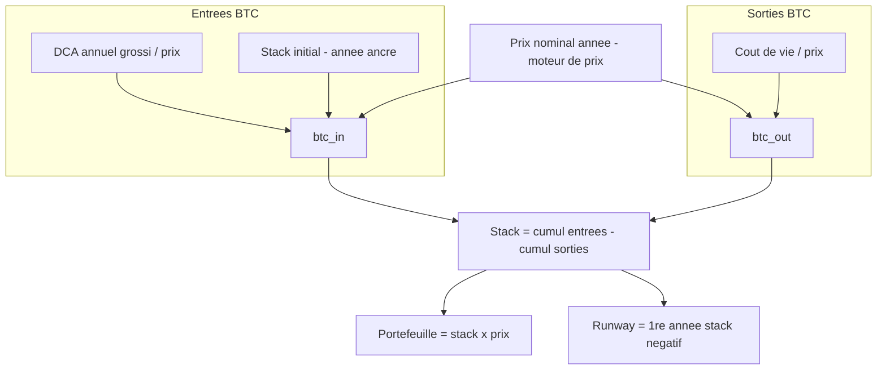
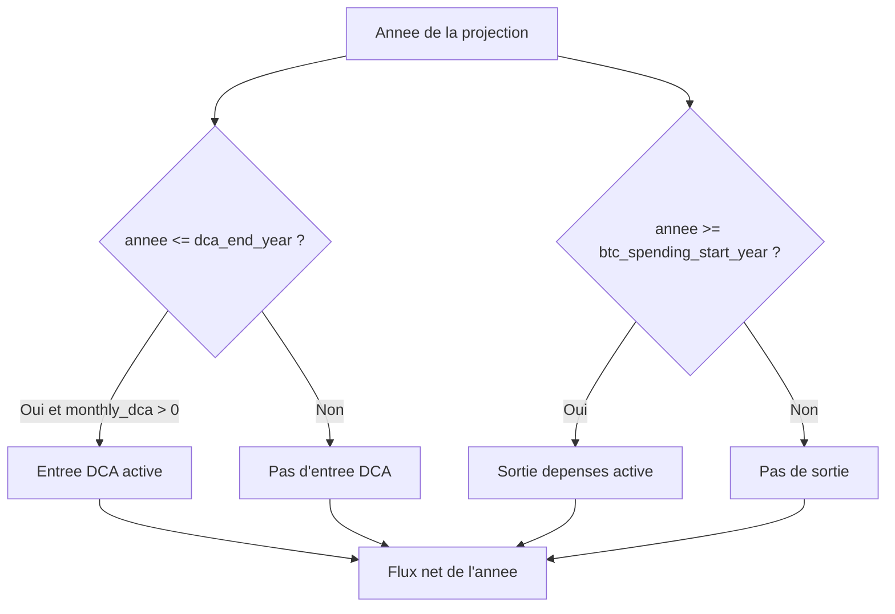

# Spécification fonctionnelle — Module Flux d'accumulation / consommation

**Projet :** Bitcoin Retirement Forecast (application Python)
**Bloc :** Module Flux (DCA + drawdown en flux net : accumulation, consommation, stack, portefeuille, runway)
**Version :** v1.1
**Date :** 4 juin 2026
**Documents parents :** Cadrage v2.1 ; Spécification de l'existant REF v1.0 (référence **moteur de prix**) ; `Bitcoin_Subsidy.ods` (référence **mécanique de flux**) ; Spec Synchronisation v1.3 ; Spec Agrégation v1.2
**Convention de langue :** noms de champs techniques, libellés UI et logs en **anglais** ; prose explicative en **français**.
**Statut :** Prêt pour validation (tous les points tranchés).
**Évolution v1.1 :** assouplissement de la plage de `initial_stack` de **`> 0`** à **`≥ 0`** (§3.1, §5, §7), pour autoriser le scénario légitime d'**accumulation pure depuis zéro** (DCA actif, stack initial nul). Aucun impact périmètre ni mécanique ; seule la validation de saisie change. Décision actée en séance B5 (cadrage du plan de tests).

---

## 1. Objectifs du bloc

- **Accumuler** du BTC via un flux de DCA mensuel, agrégé à l'année, croissant à un taux annuel libre, converti au prix nominal projeté de l'année.
- **Consommer** du BTC pour couvrir le coût de la vie à partir d'une année de début des dépenses, converti au prix nominal de l'année.
- **Sommer** ces deux flux en un **flux net annuel**, les deux pouvant se chevaucher, et en déduire le stack BTC cumulé.
- **Valoriser** le portefeuille année par année et **déterminer** le runway (année d'épuisement du stack).
- Le tout **recalculé à chaque lancement**, en aval du moteur de prix dont il consomme le prix nominal annuel.

---

## 2. Périmètre

### 2.1 Ce que ce bloc fait

Le module transforme les paramètres utilisateur de flux (DCA, coût de la vie, taux) et le prix nominal annuel (fourni par le moteur de prix) en une trajectoire annuelle de stack BTC et de valeur de portefeuille. Il gère l'accumulation, la consommation, leur somme nette, l'injection du stack initial, et le calcul du runway. Il reproduit fidèlement la mécanique de flux de `Bitcoin_Subsidy.ods`.

### 2.2 Ce que ce bloc ne fait pas

Le module ne calcule pas le prix nominal du BTC (module Moteur de prix, réf. REF v1.0) ni l'ARR. Il ne synchronise ni n'interpole les données (module Synchronisation). Il ne calcule pas la moyenne annuelle glissante, l'ARR glissant ni la MM6 (module Agrégation). Il ne gère ni fiscalité, ni plus-values, ni multi-profils, ni multi-scénarios.

---

## 3. Données en entrée

### 3.1 Paramètres utilisateur

| Champ (EN) | Libellé UI (EN) | Type | Défaut | Obligatoire |
|---|---|---|---|---|
| `initial_stack` | Initial BTC stack | décimal BTC (≥ 0) | — | Oui |
| `monthly_dca` | Monthly DCA amount | décimal USD | 0 | Non |
| `dca_growth_rate` | DCA growth per year | taux | 0 | Non |
| `dca_end_year` | DCA end year | entier | — | Non (requis si `monthly_dca` > 0) |
| `btc_spending_start_year` | BTC spending start year | entier | — | Oui |
| `monthly_living_cost` | Monthly living cost | décimal USD | 2500 | Oui |
| `spending_growth_rate` | Spending growth per year | taux | — | Oui |
| `inflation_rate` | Inflation per year | taux | 0.06 | Oui |

### 3.2 Données fournies par les autres modules

| Donnée | Source | Description |
|---|---|---|
| `nominal_price(année)` | Module Moteur de prix (réf. REF v1.0) | Prix nominal projeté du BTC pour chaque année ; **seul point de jointure** entre référentiels |
| `anchor_year` | Module Agrégation | Année du dernier mois clos ; origine du compteur `C` |

### 3.3 Compteur d'années

```
C(année) = année − anchor_year
```

`C = 0` à l'année d'ancre, `C = 1` à la première année projetée. Ce compteur est l'équivalent dynamique du `N = année − 2025` de REF v1.0 (où l'ancre était figée à 2025) et du `Nb d'années` de `Bitcoin_Subsidy.ods`.

> **Point critique hérité (REF §4.1) :** la première année projetée utilise `C = 1`, jamais `C = 0`. Un `C = 0` réintroduirait le bug V4 (dépenses de la 1ʳᵉ année non augmentées). L'année d'ancre porte `C = 0` (montants à leur valeur de base).

---

## 4. Règles fonctionnelles

Les règles reproduisent les formules de `Bitcoin_Subsidy.ods` (feuilles par profil, ex. `Yoan - Paris - Scenario Base`), avec l'ancre figée 2025 du fichier généralisée en `anchor_year`.

### 4.1 Flux d'accumulation (DCA)

Le DCA est un montant mensuel fixe en USD, croissant chaque année au taux `dca_growth_rate`, agrégé à l'année (× 12), converti en BTC au prix nominal de l'année. Il est actif tant que l'année reste inférieure ou égale à `dca_end_year`.

```
dca_amount_year(année) = monthly_dca × (1 + dca_growth_rate) ^ C(année) × 12

si monthly_dca > 0
    et année ≤ dca_end_year
alors btc_in_dca(année) = dca_amount_year(année) / nominal_price(année)
sinon btc_in_dca(année) = 0
```

Réf. Subsidy colonne `J` : `=IF(B ≤ H6 ; (H4 × (1+H5)^C) × 12 / F ; 0)`.

### 4.2 Injection du stack initial

Le stack initial détenu à ce jour est injecté **une seule fois**, comme entrée de l'année d'ancre.

```
si année = anchor_year
alors btc_in_initial(année) = initial_stack
sinon btc_in_initial(année) = 0
```

Réf. Subsidy : le terme `+ H3` ajouté à la ligne d'ancre (`J26 = IF(...) + H3`).

Total des entrées d'une année :
```
btc_in(année) = btc_in_dca(année) + btc_in_initial(année)
```

### 4.3 Flux de consommation (drawdown)

Le coût de la vie annuel est converti en BTC au prix nominal de l'année, à partir de `btc_spending_start_year`.

```
cdv_inflation(année) = monthly_living_cost × 12 × (1 + inflation_rate) ^ C(année)        # informatif
cdv_train(année)     = cdv_inflation(année) × (1 + spending_growth_rate) ^ C(année)        # pilote la dépense

si année ≥ btc_spending_start_year
alors btc_out(année) = cdv_train(année) / nominal_price(année)
sinon btc_out(année) = 0
```

Réf. Subsidy : `H = base × (1+inflation)^C`, `I = H × (1+spending_growth)^C`, `K = IF(B ≥ E6 ; I / F ; 0)`.

> **DEC-DCA-03 — Inflation composée dans la dépense (tranché).** Le coût de la vie qui pilote la consommation **compose** inflation et croissance des dépenses : `cdv_train = base × (1+inflation)^C × (1+spending_growth)^C`. L'inflation est la hausse de base toujours appliquée à la dépense réelle ; `spending_growth` est la hausse de train de vie **par-dessus** l'inflation. Fidèle à `Bitcoin_Subsidy.ods` (colonnes H et I). L'alternative REF v1.0 §4.7 (inflation purement informative, `cdv_train = base × (1+spending_growth)^C`) est **écartée**.

### 4.4 Flux net et stack cumulé

Le stack à une année donnée est le cumul de toutes les entrées moins le cumul de toutes les sorties depuis l'année d'ancre. Les deux flux étant indépendants, ils peuvent se chevaucher (entrée et sortie la même année).

```
stack(année) = Σ_{a = anchor_year .. année} btc_in(a)  −  Σ_{a = anchor_year .. année} btc_out(a)
```

Réf. Subsidy colonne `L` : `=SUM($J$26:J) − SUM($K$26:K)`.

> **Conséquence du chevauchement :** le stack n'est plus nécessairement monotone décroissant. Si `btc_in(année) > btc_out(année)`, il remonte. Cela conditionne la définition du runway (§4.6).

### 4.5 Valeur du portefeuille

```
portfolio(année) = stack(année) × nominal_price(année)
```

Réf. Subsidy colonne `M` : `=L × F`.

### 4.6 Runway et post-épuisement

Le runway est l'écart, en années, entre l'année d'ancre et la première année où le stack devient négatif.

```
runway = (première année où stack(année) < 0) − anchor_year
si le stack ne devient jamais négatif sur l'horizon
alors runway = ∞
```

Conformément à REF §4.11 (généralisé) et au comportement observé dans Subsidy. Après épuisement, **la projection continue en valeurs négatives** (stack et portefeuille négatifs) afin de visualiser l'ampleur du déficit — comportement vérifié dans Subsidy (stack négatif maintenu jusqu'en fin d'horizon).

> **Caveat chevauchement (assumé) :** en présence d'un flux d'entrée actif, le stack pourrait théoriquement repasser positif après un passage négatif. La définition retenue signale la **première** bascule négative, fidèle au fichier de référence ; aucune logique de « repositivation » n'est introduite (pas de sur-ingénierie).

---

## 5. Cas de rejet et comportements limites

| Motif | Condition | Comportement |
|---|---|---|
| DCA absent | `monthly_dca = 0` | Aucune entrée DCA ; seul le stack initial et la consommation jouent (= comportement drawdown pur de REF) |
| Stack initial nul | `initial_stack = 0` et `monthly_dca > 0` | **Valide (v1.1)** : accumulation pure depuis zéro ; l'injection à l'ancre vaut +0, le stack se construit entièrement par le DCA. `initial_stack < 0` reste invalide ; `initial_stack` **absent** reste un paramètre obligatoire manquant (≠ 0) |
| Retraite « année 0 » | `btc_spending_start_year = anchor_year + 1` | Consommation dès la 1ʳᵉ année projetée |
| Chevauchement | `dca_end_year ≥ btc_spending_start_year` | Années avec entrée ET sortie ; flux net appliqué normalement |
| Hold pur | `dca_end_year < btc_spending_start_year` | Années intermédiaires sans flux ; stack seulement revalorisé par le prix |
| Stack négatif | dépenses cumulées > entrées cumulées | Stack puis portefeuille négatifs ; projection poursuivie (runway atteint) |
| Runway infini | stack jamais négatif sur l'horizon | `runway = ∞` |
| Prix nominal nul ou manquant | `nominal_price(année)` indisponible | Division impossible ; à gérer en aval (le moteur garantit un prix > 0 en pratique) |
| Paramètre obligatoire manquant | `initial_stack`, `btc_spending_start_year`, `monthly_living_cost`, `spending_growth_rate`, `inflation_rate` absent | Calcul non lancé ; signalé en UI |
| `dca_end_year` manquant avec DCA actif | `monthly_dca > 0` et `dca_end_year` vide | Rejet de saisie ; `dca_end_year` requis dès qu'un montant DCA est posé |

---

## 6. Données en sortie

### 6.1 Trajectoire annuelle (vers structure d'export figée)

Une ligne par année, de `anchor_year` à l'horizon :

| Champ (EN) | Type | Description |
|---|---|---|
| `year` | entier | Année civile |
| `c` | entier | Compteur `année − anchor_year` |
| `nominal_price` | décimal USD | Prix nominal (entrée, repris pour traçabilité) |
| `dca_amount_year` | décimal USD | Montant DCA agrégé de l'année (informatif) |
| `btc_in` | décimal BTC | Entrées de l'année (DCA + injection initiale) |
| `cdv_inflation` | décimal USD | Coût de la vie indexé inflation (informatif) |
| `cdv_train` | décimal USD | Coût de la vie pilotant la dépense |
| `btc_out` | décimal BTC | Sorties de l'année (consommation) |
| `stack` | décimal BTC | Stack cumulé net |
| `portfolio` | décimal USD | Valeur du portefeuille |

### 6.2 Grandeurs de synthèse (KPI)

| Champ (EN) | Type | Description |
|---|---|---|
| `runway` | entier ou ∞ | Années avant épuisement du stack |
| `current_portfolio` | décimal USD | `initial_stack × anchor_price` (valeur à l'ancre) |
| `total_btc_accumulated` | décimal BTC | Σ `btc_in_dca` sur la fenêtre DCA (hors stack initial) |

---

## 7. Paramètres configurables

Tous les paramètres de §3.1 sont des **réglages utilisateur** (libres). Aucune constante d'intégrité Bear n'appartient à ce module : il consomme le prix nominal, il ne le calcule pas.

| Paramètre | Rôle | Référence | Plage valide |
|---|---|---|---|
| `initial_stack` | Stack BTC de départ | — | ≥ 0 |
| `monthly_dca` | Accumulation mensuelle | 0 | ≥ 0 |
| `dca_growth_rate` | Croissance annuelle du DCA (libre) | 0 | ≥ −1 |
| `dca_end_year` | Fin d'accumulation | — | `anchor_year` … horizon |
| `btc_spending_start_year` | Début des dépenses | — | `anchor_year+1` … horizon |
| `monthly_living_cost` | Base du coût de la vie | 2500 | > 0 |
| `spending_growth_rate` | Croissance des dépenses (libre) | — | ≥ −1 |
| `inflation_rate` | Inflation (libre, non corrélée aux dépenses) | 0.06 | ≥ −1 |

> Aucun ordonnancement imposé entre `dca_end_year` et `btc_spending_start_year` (chevauchement autorisé). `inflation_rate` et `spending_growth_rate` sont indépendants ; un avertissement UI non bloquant pourra signaler une dépense croissant sous l'inflation, sans la bloquer (à voir en conception).

---

## 8. Diagrammes

### Figure 1 — Calcul annuel du flux net



### Figure 2 — Activation des deux flux dans le temps



---

## 9. Questions ouvertes

- [ ] Horizon de projection : 2072 (cadrage) vs 2100 (Subsidy) → sans incidence sur la mécanique ; à confirmer.
- [ ] Précision numérique / arrondis → spec technique, à aligner sur la suite de non-régression contre Subsidy.

### Décisions tranchées (séance + fichiers de référence)

- ✅ **Inflation composée dans la dépense** (DEC-DCA-03) : `cdv_train = base × (1+inflation)^C × (1+spending_growth)^C`
- ✅ **Deux flux indépendants, chevauchement autorisé** (DEC-DCA-01)
- ✅ **Croissance du DCA** = taux libre, distinct des dépenses (DEC-DCA-02)
- ✅ **Conversion DCA** au prix nominal annuel, agrégé à l'année
- ✅ **Compteur unique** `C = année − anchor_year` (0 à l'ancre, 1 à la 1ʳᵉ année projetée)
- ✅ **Stack initial** injecté comme entrée de l'année d'ancre
- ✅ **Runway** = 1ʳᵉ année où stack < 0 ; post-épuisement projeté en négatif
- ✅ **Référentiel de flux** = `Bitcoin_Subsidy.ods` (DEC-SOURCES-01)
- ✅ **`initial_stack ≥ 0`** (v1.1) — accumulation pure depuis zéro autorisée ; `< 0` invalide, absent = obligatoire manquant

---

## 10. Glossaire

| Terme | Définition |
|---|---|
| **Flux net** | Stack = cumul des entrées (DCA + stack initial) − cumul des sorties (dépenses) |
| **btc_in / btc_out** | Quantités de BTC entrant (accumulation) / sortant (consommation) une année donnée |
| **Compteur `C`** | `année − anchor_year` ; 0 à l'ancre, 1 à la 1ʳᵉ année projetée |
| **Chevauchement** | Année où accumulation et consommation sont toutes deux actives |
| **Hold pur** | Année sans flux (ni DCA ni dépense), stack seulement revalorisé par le prix |
| **cdv_train** | Coût de la vie pilotant la dépense convertie en BTC |
| **cdv_inflation** | Coût de la vie indexé inflation, informatif (non converti en BTC) |
| **Runway** | Nombre d'années avant la 1ʳᵉ bascule négative du stack |
| **Prix nominal** | Prix BTC projeté par le moteur ; seule grandeur consommée par ce module |

---

*Spécification fonctionnelle du module Flux d'accumulation / consommation v1.1. Prête pour validation — tous les points tranchés. Seule évolution depuis v1.0 : `initial_stack ≥ 0` (accumulation pure depuis zéro autorisée).*
