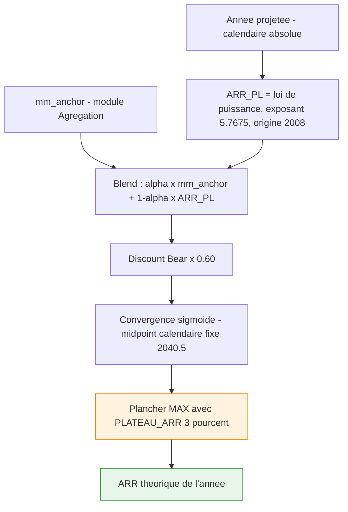
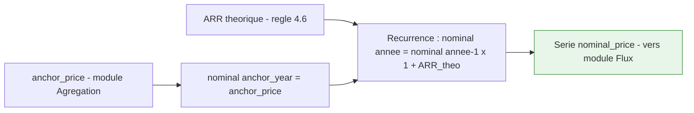

# Spécification fonctionnelle — Module Moteur de prix

**Projet :** Bitcoin Retirement Forecast (application Python)
**Bloc :** Module Moteur de prix (loi de puissance, blend, discount Bear, convergence sigmoïde, plancher, capitalisation → prix nominal)
**Version :** v1.0
**Date :** 3 juin 2026
**Documents parents :** Cadrage v2.1 ; Spécification de l'existant REF v1.0 (référence **moteur de prix**) ; `Bitcoin_Subsidy.ods` (référence **mécanique de flux**, pour la jointure prix→flux) ; Spec Synchronisation v1.3 ; Spec Agrégation v1.1 ; Spec Flux v1.0
**Convention de langue :** noms de champs techniques, libellés UI et logs en **anglais** ; prose explicative en **français**.
**Statut :** Prêt pour validation.

---

## 1. Objectifs du bloc

- **Calculer**, pour chaque année de projection, l'ARR théorique du Bitcoin selon le scénario Bear modéré : loi de puissance, blend décroissant avec la moyenne mobile d'ancrage, discount Bear, convergence sigmoïde vers un plateau figé.
- **Capitaliser** le prix nominal année par année à partir du prix d'ancrage fourni par le module Agrégation.
- **Généraliser** l'ancre figée de l'existant (`2025`/`2026` codés en dur) en une **ancre dynamique** (`anchor_year`), tout en préservant les rails calendaires fixes du modèle (origine de la loi de puissance, calage de la sigmoïde).
- **Exposer** la série de prix nominaux annuels — **seule grandeur consommée par le module Flux** (jointure unique, DEC-SOURCES-01).
- Le tout **recalculé à chaque lancement**, en aval de l'agrégation dont il consomme l'ancre et la MM d'ancrage.

---

## 2. Périmètre

### 2.1 Ce que ce bloc fait

Le module transforme l'ancre (année, prix) et la MM d'ancrage — toutes deux produites par le module Agrégation — en une série annuelle de prix nominaux projetés, via le modèle d'appréciation Bear modéré. Il produit l'ARR théorique de chaque année projetée, l'assemble en prix nominal par capitalisation, et expose cette série à structure stable. Il réimplémente fidèlement les règles de prix de `forecast_bear_final.ods` (cellule K37 pour l'ARR théorique, colonne L pour la capitalisation), avec l'ancre figée 2025/2026 généralisée en `anchor_year`.

### 2.2 Ce que ce bloc ne fait pas

Le module ne synchronise ni n'interpole les données (module Synchronisation). Il ne calcule ni la moyenne annuelle glissante, ni l'ARR glissant, ni la MM6, ni le point d'ancrage (module Agrégation) — il les **consomme**. Il ne calcule ni le coût de la vie, ni les dépenses en BTC, ni le stack, ni le portefeuille, ni le runway (module Flux). Il ne déflate pas le prix réel (déplacé en présentation — voir §2.3). Il ne gère aucune saisie manuelle d'ARR réel (état `user` abandonné au cadrage) : **en projection, l'ARR est toujours théorique**.

### 2.3 Reventilation des 12 règles de REF v1.0

REF v1.0 §4 mélangeait moteur de prix, agrégation et flux dans une seule chaîne tableur. La migration les éclate en modules. Tableau de correspondance (fait foi sur la frontière du module) :

| Règle REF v1.0 | Objet | Destination dans la migration |
|---|---|---|
| 4.1 — Compteur `N` | indexation années | **Flux** (`C = année − anchor_year`) ; le moteur indexe par année calendaire absolue |
| 4.2 — MM4 d'ancrage | moyenne mobile | **Agrégation** (devient MM6, fenêtre figée côté Agrégation) |
| 4.3 — ARR réel saisi | saisie manuelle | **Supprimé** (état `user` abandonné) |
| **4.4 — ARR théorique** | power law + blend + discount + sigmoïde | **★ Moteur de prix (ce module)** |
| **4.5 — Prix nominal** | capitalisation | **★ Moteur de prix (ce module)** — branche ARR réel supprimée |
| 4.6 — Prix réel | déflation base ancre | **Présentation / structure d'export** (consomme `inflation_rate`, param Flux) |
| 4.7 — Coût de la vie | cdv_inflation / cdv_train | **Flux** (DEC-DCA-03) |
| 4.8 — Dépenses en BTC | conversion | **Flux** |
| 4.9 — Stack résiduel | flux net | **Flux** |
| 4.10 — Portefeuille | valorisation | **Flux** |
| 4.11 — Runway | autonomie | **Flux** |
| 4.12 — Portefeuille actuel | `stack × prix réf` | **Flux** (KPI `current_portfolio`) |

→ **Le moteur de prix porte exactement REF §4.4 et §4.5**, avec l'ancre dynamique. Tout le reste a migré.

---

## 3. Données en entrée

### 3.1 Données fournies par le module Agrégation

| Champ (EN) | Type | Source | Description | Obligatoire |
|---|---|---|---|---|
| `anchor_year` | entier | Agrégation | Année du dernier mois clos ; la projection démarre à `anchor_year + 1` | Oui |
| `anchor_price` | décimal USD | Agrégation | Prix d'ancrage = `rolling_annual_avg` au dernier mois clos ; point de départ de la capitalisation | Oui |
| `mm_anchor` | décimal (taux) | Agrégation | Valeur de la MM d'ancrage (MM6). **Le moteur est agnostique à la taille de fenêtre** : il consomme un scalaire, la fenêtre (`MM_WINDOW_YEARS`) est une constante centralisée côté Agrégation | Oui |

> **Point critique vérifié dans le pilote.** L'ancre de capitalisation est le **dernier prix réel** (colonne L du pilote, ex. `L35 = 101 700`), **pas** le paramètre « Prix réf. 2025 » (`F6`). Dans le pilote ces deux cellules valent toutes deux 101 700 mais ont des rôles distincts : `F6` ne sert qu'au KPI `current_portfolio` (module Flux). La migration ne doit **pas** les confondre : `anchor_price` vient d'Agrégation (`rolling_annual_avg`), `F6` part dans Flux.

### 3.2 Constantes d'intégrité Bear

Constantes de code, ajustables **par release uniquement**, jamais exposées en réglage utilisateur (cf. Cadrage §4, principe d'intégrité du scénario Bear).

| Constante (EN) | Valeur | Rôle |
|---|---|---|
| `POWER_LAW_EXPONENT` | 5,7675 | Pente de la loi de puissance sur le prix |
| `POWER_LAW_TIME_ORIGIN` | 2008 | Origine du temps `t = année − 2008` — **rail calendaire fixe** |
| `BEAR_DISCOUNT` | 0,60 | Facteur appliqué à l'ARR de base (sous-performance −40 %) |
| `BLEND_WINDOW_YEARS` | 6 | Durée de transition blend MM → loi de puissance |
| `PLATEAU_ARR` | 0,03 | Plateau d'ARR asymptotique long terme — **figé** |
| `PLATEAU_YEAR` | 2055 | Horizon d'atteinte du plateau — **figé** |
| `SIGMOID_CONSTANT` | ln(19) | Calibre la pente pour ~95 % de transition à `PLATEAU_YEAR` |
| `SIGMOID_CALENDAR_ORIGIN` | 2026 | Origine calendaire du midpoint de la sigmoïde — **rail calendaire fixe** (DEC-MOTEUR-01) |

> **`MM_WINDOW_YEARS` (= 6) n'est PAS une constante de ce module** : c'est une constante centralisée du module Agrégation. Le moteur ne la voit jamais — il ne reçoit que la valeur scalaire `mm_anchor`. Ce découplage permet de balayer la fenêtre (`{4, 6, 8}`) en test sans toucher au moteur.

### 3.3 Paramètres utilisateur propres au module

**Aucun.** Le moteur ne consomme que l'ancre (Agrégation) et des constantes figées. Contrairement à REF (où le plateau `F7` et l'année plateau `F8` étaient des paramètres utilisateur), le cadrage les a reclassés en **constantes d'intégrité Bear**. Le moteur produit le prix nominal ; il ne calcule rien à partir d'un réglage utilisateur direct.

---

## 4. Règles fonctionnelles

Les règles reproduisent la cellule `K37` (ARR théorique) et la colonne `L` (capitalisation) de `forecast_bear_final.ods`, avec l'ancre figée 2025/2026 du fichier généralisée en `anchor_year` selon les exceptions de la règle 4.7.

### 4.1 Horizon et indexation

```
nominal_price(anchor_year) = anchor_price          # ancre : pas d'ARR théorique
projection : année ∈ [ anchor_year + 1 .. HORIZON ]
```

Le moteur **n'a pas de compteur `C`/`N` propre** : il indexe par **année calendaire absolue**. L'année d'ancre ne reçoit jamais d'ARR théorique (elle porte le prix réel observé). La première année projetée est `anchor_year + 1`.

> **Garde anti-régression du bug V4.** Le décalage d'indexation qui affectait les dépenses dans REF (V4 : `N = 0` en 1ʳᵉ année projetée) vit **dans le module Flux** (compteur `C`), pas ici. Le moteur de prix n'expose aucun compteur indexé ; toute réintroduction d'un `C = 0` côté prix serait une erreur. L'ancre n'a pas d'ARR, point.

### 4.2 ARR loi de puissance

Le prix suit une loi de puissance d'exposant 5,7675, origine du temps en 2008. L'ARR dérivé entre deux années consécutives :

```
t = année − POWER_LAW_TIME_ORIGIN                  # = année − 2008
ARR_PL(année) = ( t / (t − 1) ) ^ POWER_LAW_EXPONENT − 1
```

Réf. pilote (extrait de `K37`) : `((H-2008)/(H-2009))^5,7675 − 1`. L'origine 2008 est un **rail calendaire fixe**, jamais réancrée.

### 4.3 Blend MM d'ancrage → loi de puissance

Sur les `BLEND_WINDOW_YEARS` (6) premières années après l'ancre, l'ARR de base mélange la MM d'ancrage (régime récent) et la loi de puissance, avec un poids `alpha` décroissant linéairement de 1 (à l'ancre) vers 0 (au-delà de 6 ans).

```
alpha(année) = MAX( 0 ; 1 − (année − anchor_year) / BLEND_WINDOW_YEARS )
ARR_base(année) = alpha(année) × mm_anchor + (1 − alpha(année)) × ARR_PL(année)
```

> **Réancrage du blend.** Le littéral `2025` de REF (`(H-2025)/6`) devient `anchor_year`. C'est l'un des deux endroits où l'ancre se réancre avec les données fraîches (l'autre étant `anchor_price`). À `anchor_year = 2025`, la formule retombe exactement sur REF.

### 4.4 Discount Bear modéré

```
ARR_disc(année) = ARR_base(année) × BEAR_DISCOUNT       # × 0,60
```

Minoration durable de 40 % traduisant une sous-performance du canal historique, sans rupture de la loi de puissance.

### 4.5 Convergence sigmoïde et plancher

L'ARR convergé décroît continûment vers `PLATEAU_ARR` à l'horizon `PLATEAU_YEAR`. Le terme `MAX(… ; PLATEAU_ARR)` garantit que l'ARR ne descend jamais sous le plateau.

```
midpoint = ( SIGMOID_CALENDAR_ORIGIN + PLATEAU_YEAR ) / 2     # = (2026 + 2055)/2 = 2040,5 — FIXE
k = SIGMOID_CONSTANT / ( PLATEAU_YEAR − midpoint )            # = ln(19) / 14,5 — FIXE
sigmoïde(année) = 1 / ( 1 + e ^ ( −k × (année − midpoint) ) )
ARR_théo(année) = MAX( ARR_disc(année) × (1 − sigmoïde) + PLATEAU_ARR × sigmoïde ; PLATEAU_ARR )
```

> **Convergence calendaire (DEC-MOTEUR-01).** Le `2026` du midpoint **ne devient PAS** `anchor_year + 1` : il reste un **rail calendaire fixe**. Avec `PLATEAU_YEAR` lui-même figé, le midpoint et `k` sont **entièrement constants** (2040,5 et ln(19)/14,5). Le calendrier de convergence vers le plateau est donc indépendant de la date de lancement — ce qui évite la compression/falaise des lancements tardifs et toute division par zéro post-2054.

### 4.6 ARR théorique — assemblage

L'ARR théorique d'une année projetée est la composition séquentielle des règles 4.2 → 4.5 :

```
ARR_théo = MAX(
    ( [ alpha × mm_anchor + (1−alpha) × ARR_PL ] × 0,60 ) × (1 − sigmoïde)
    + PLATEAU_ARR × sigmoïde
  ; PLATEAU_ARR )
```

Ordre **vérifié** par décodage de `K37` : loi de puissance → blend → discount → sigmoïde → plancher.

### 4.7 Capitalisation — prix nominal

Le prix nominal se construit par capitalisation à partir du prix d'ancrage. En projection, l'ARR est **toujours théorique** (plus de branche ARR réel saisi).

```
nominal_price(anchor_year) = anchor_price
pour année ∈ [ anchor_year + 1 .. HORIZON ] :
    nominal_price(année) = nominal_price(année − 1) × ( 1 + ARR_théo(année) )
```

> **Simplification vs REF.** La formule pilote `L37 = IF(ISNUMBER(J37); L35×(1+J37); L35×(1+K37))` **s'effondre** sur sa seule branche théorique : `nominal(année) = nominal(année−1) × (1 + ARR_théo)`. La saisie manuelle d'ARR réel (colonne J) disparaît. Le réel n'entre dans le modèle que par l'**ancre** (`anchor_price`) et la **MM d'ancrage** (`mm_anchor`), tous deux fournis par Agrégation.

### 4.8 Cartographie des littéraux d'ancrage

Trois littéraux calendaires de REF, trois traitements distincts — **vérifié verbatim dans `K37` du pilote** :

| Littéral REF / pilote | Rôle | Traitement migration | Statut |
|---|---|---|---|
| `2008` / `2009` (loi de puissance) | origine du temps `t` | **reste fixe** (`POWER_LAW_TIME_ORIGIN`) | Vérifié |
| `2025` (`alpha` du blend) | ancre du blend | **→ `anchor_year`** (se réancre) | Vérifié |
| `2026` (midpoint sigmoïde) | calage calendaire | **reste fixe** (`SIGMOID_CALENDAR_ORIGIN`, DEC-MOTEUR-01) | Vérifié |

> **Conséquence à assumer.** Dès que `anchor_year ≠ 2025`, le blend (réactif, réancré) et la sigmoïde (calendaire, figée) **ne partagent plus de référence commune**. C'est voulu : l'ancrage court terme suit les données fraîches, le glissement long terme vers le plateau reste sur un rail calendaire stable. Pour un lancement très tardif (ancre proche du plateau), la sigmoïde est déjà ~1 et `ARR_théo ≈ PLATEAU_ARR` quel que soit le blend — comportement sain, pas de pathologie.

### 4.9 Garde-fou sigmoïde

```
si ( PLATEAU_YEAR − midpoint ) ≤ ε :
    ARR_théo(année) = PLATEAU_ARR        # court-circuit (évite division par ~0)
```

> **Inactif en V1, documenté.** Sous l'option B, le dénominateur vaut `PLATEAU_YEAR − midpoint = (PLATEAU_YEAR − 2026)/2 = 14,5`, constant et jamais nul. Le court-circuit est donc **mort en V1**. Il reste spécifié comme filet pour une release future qui modifierait `PLATEAU_YEAR` (constante d'intégrité ajustable par release).

### 4.10 Vecteur de non-régression (point fixe `anchor_year = 2025`)

La non-régression au cent près contre REF v1.0 est **structurelle** : on injecte l'ancre et la MM aux valeurs du pilote, et le moteur doit reproduire la capitalisation exacte.

```
anchor_year  = 2025
anchor_price = 101 700        # = L35 du pilote (dernier prix réel)
mm_anchor    = 0,3613         # = C12 du pilote (MM4, AVERAGE(J32:J35))
→ nominal_price(2026 .. 2072) doit reproduire L37 .. L83 au cent près
```

> **Vérifié dans le pilote.** À `anchor_year = 2025`, les règles 4.1–4.7 retombent exactement sur `K37`/colonne `L`. La taille de fenêtre MM (MM6 en production) est validée **séparément** contre le module Agrégation — d'où l'injection de `mm_anchor` comme scalaire. En production, `anchor_price` et `mm_anchor` viennent du glissant : le modèle diverge alors **volontairement** de REF (non-déterminisme assumé, Cadrage).

---

## 5. Cas de rejet et comportements limites

| Motif (EN) | Condition de déclenchement | Comportement |
|---|---|---|
| `ARR_FLOOR` | `ARR_théo` calculé < `PLATEAU_ARR` | Ramené au plateau via `MAX(… ; PLATEAU_ARR)` ; comportement nominal, pas une erreur |
| `SIGMOID_GUARD` | `PLATEAU_YEAR − midpoint ≤ ε` | `ARR_théo = PLATEAU_ARR` (court-circuit) ; **inactif sous option B** |
| `POWERLAW_DIV0` | année = 2009 (`t − 1 = 0`) | Non atteignable : la projection démarre à `anchor_year + 1 ≥ 2026`, donc `t − 1 ≥ 17` |
| `ANCHOR_MISSING` | `anchor_price` absent ou ≤ 0 | Calcul non lançable ; signalé. Dépend d'Agrégation (profondeur insuffisante) |
| `MM_MISSING` | `mm_anchor` absent | Calcul non lançable ; signalé. Dépend d'Agrégation (< profondeur MM requise) |
| Lancement post-plateau | `anchor_year ≥ PLATEAU_YEAR` | Sigmoïde ≈ 1 sur tout l'horizon → `ARR_théo ≈ PLATEAU_ARR` ; comportement sain |

---

## 6. Données en sortie

### 6.1 Série de prix (vers module Flux et structure d'export)

| Champ (EN) | Type | Destination | Description |
|---|---|---|---|
| `nominal_price` | décimal USD | **Module Flux (jointure unique)** + structure d'export | Prix nominal par année, `anchor_year` … `HORIZON` |
| `arr_theo` | décimal (taux) | Structure d'export / UI (diagnostic) | ARR théorique par année, `anchor_year + 1` … `HORIZON` |

> `nominal_price` est la **seule grandeur** consommée par le module Flux (DEC-SOURCES-01). `arr_theo` est exposé pour transparence et pour le graphe « ARR théorique · décroissance Bear » du dashboard.

### 6.2 Grandeurs de diagnostic (UI / logs)

| Champ (EN) | Description |
|---|---|
| `sigmoid_midpoint` | Midpoint calculé (= 2040,5 sous option B) — transparence sur le calage |
| `sigmoid_k` | Pente `k` calculée (= ln(19)/14,5) |
| `blend_alpha_series` | Les `alpha` par année sur la fenêtre de blend (transparence sur la transition MM → loi de puissance) |

Tracé en log au niveau INFO à chaque recalcul : `ENGINE_ANCHOR: year=<anchor_year> price=<anchor_price> mm=<mm_anchor>` et `ENGINE_SIGMOID: midpoint=<v> k=<v>`.

---

## 7. Paramètres configurables

**Aucun paramètre utilisateur propre à ce module.** Toutes les valeurs qui pilotent le moteur sont soit des **entrées d'Agrégation** (`anchor_year`, `anchor_price`, `mm_anchor`), soit des **constantes d'intégrité Bear** (§3.2), ajustables par release uniquement. Ce choix préserve l'intégrité du scénario Bear : le modèle ne peut être rendu artificiellement optimiste par un réglage utilisateur.

| Constante | Rôle | Valeur de référence | Ajustable |
|---|---|---|---|
| `POWER_LAW_EXPONENT` | Pente loi de puissance | 5,7675 | Par release |
| `POWER_LAW_TIME_ORIGIN` | Origine du temps | 2008 | Par release |
| `BEAR_DISCOUNT` | Minoration Bear | 0,60 | Par release |
| `BLEND_WINDOW_YEARS` | Fenêtre de blend | 6 | Par release |
| `PLATEAU_ARR` | Plateau asymptotique | 0,03 | Par release |
| `PLATEAU_YEAR` | Horizon plateau | 2055 | Par release |
| `SIGMOID_CALENDAR_ORIGIN` | Rail calendaire sigmoïde | 2026 | Par release |
| `SIGMOID_CONSTANT` | Calage 95 % à `PLATEAU_YEAR` | ln(19) | Dérivé, fixe |

---

## 8. Diagrammes

### Figure 1 — Chaîne de calcul de l'ARR théorique (par année projetée)



### Figure 2 — Capitalisation du prix nominal



---

## 9. Questions ouvertes

- [OUVERT] **Horizon de projection** : 2072 (cadrage) vs 2100 (observé dans `Bitcoin_Subsidy.ods`). Sans incidence sur la mécanique du moteur ; à confirmer avant la spec technique. → Décision attendue de : Niko.
- [ ] Précision numérique / arrondis de l'ARR et de la capitalisation → spec technique, à aligner sur la suite de non-régression contre REF (point fixe ancre 2025).
- [ ] Forme exacte du court-circuit `SIGMOID_GUARD` (valeur de `ε`) → spec technique ; sans objet fonctionnel sous option B.

### Décisions tranchées (séance B4 + fichiers de référence)

- ✅ **Ordre des étapes** — loi de puissance → blend → discount → sigmoïde → plancher (vérifié par décodage de `K37`).
- ✅ **Ancre dynamique** — `2025` du blend → `anchor_year` ; `anchor_price` depuis Agrégation. Les littéraux `2008`/`2009` (loi de puissance) et `2026` (sigmoïde) restent des rails calendaires fixes.
- ✅ **Convergence calendaire (DEC-MOTEUR-01)** — midpoint figé à 2040,5, indépendant de la date de lancement.
- ✅ **MM injectée comme scalaire** — le moteur est agnostique à la taille de fenêtre (`MM_WINDOW_YEARS` centralisée côté Agrégation, balayable en test).
- ✅ **Non-régression structurelle** — double injection (`anchor_price = 101 700` + `mm_anchor = 0,3613`) au point fixe `anchor_year = 2025` ; reproduction de `L37:L83` au cent près.
- ✅ **Plateau et année plateau figés** — reclassés de paramètres utilisateur (REF `F7`/`F8`) en constantes d'intégrité Bear.
- ✅ **Saisie ARR réel supprimée** — en projection, l'ARR est toujours théorique ; le réel n'entre que via l'ancre et la MM.
- ✅ **Prix réel déplacé en présentation** — le moteur reste pur, ne produit que `nominal_price` (étiquette dashboard « réel base 2025 » → « réel base `anchor_year` »).
- ✅ **Garde-fou sigmoïde documenté, inactif** — filet pour une release modifiant `PLATEAU_YEAR`.

---

## 10. Glossaire

| Terme | Définition |
|---|---|
| **ARR théorique** | Taux de croissance annuel projeté du prix BTC, issu du modèle Bear (loi de puissance + blend + discount + sigmoïde + plancher) |
| **Loi de puissance** | Modèle `prix = a × t^b`, exposant 5,7675, origine du temps 2008 ; `ARR_PL = (t/(t−1))^b − 1` |
| **Blend** | Pondération transitoire `alpha` entre MM d'ancrage et loi de puissance sur 6 ans, `alpha` décroissant de 1 (ancre) à 0 |
| **MM d'ancrage (`mm_anchor`)** | Valeur scalaire de la moyenne mobile d'ARR fournie par Agrégation (MM6) ; le moteur ignore la taille de fenêtre |
| **Discount Bear** | Minoration de 40 % de l'ARR de base (× 0,60) |
| **Sigmoïde** | Fonction de transition continue faisant converger l'ARR vers le plateau, calée sur un rail calendaire fixe (midpoint 2040,5) |
| **Plateau** | Niveau d'ARR asymptotique long terme (3 %), figé ; plancher de l'ARR théorique |
| **Convergence calendaire** | Calage du midpoint de la sigmoïde sur l'origine calendaire fixe (2026), indépendant de `anchor_year` (DEC-MOTEUR-01) |
| **Ancre (`anchor_year` / `anchor_price`)** | Dernière année/prix réels connus, fournis par Agrégation ; origine de la capitalisation |
| **Prix nominal (`nominal_price`)** | Prix BTC projeté par capitalisation ; **seule grandeur consommée par le module Flux** |
| **Rail calendaire fixe** | Littéral calendaire non réancré (origine power law 2008, calage sigmoïde 2026) |
| **Non-régression structurelle** | Reproduction de REF au cent près en injectant ancre et MM aux valeurs du pilote, indépendamment de la taille de fenêtre MM |

---

*Spécification fonctionnelle du module Moteur de prix v1.0. Prête pour validation — tous les points tranchés en séance B4. Livrables suivants : spec(s) technique(s) (base SQLite, stack web, packaging GitHub), puis plan de tests (non-régression moteur vs REF au point fixe ancre 2025 ; flux vs `Bitcoin_Subsidy.ods`).*
