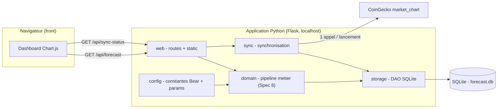
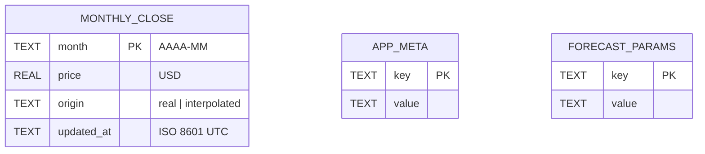

# Spécification technique 7 — Infrastructure & transverse

**Projet :** Bitcoin Retirement Forecast (application Python)
**Bloc :** Spec technique 7 — Infrastructure & transverse (stack, persistance, synchronisation, couche HTTP, packaging)
**Version :** v1.1
**Date :** 4 juin 2026
**Documents parents :** Cadrage v2.1 ; Spec Synchronisation v1.3 ; Plan de tests v1.0 ; Spec Flux v1.1, Agrégation v1.2, Moteur de prix v1.0 (modules métier hébergés, détaillés en **Spec technique 8**)
**Couture :** la **Spec technique 8** (moteur de calcul) définit le pipeline métier et le **schéma du DTO d'export** ; la présente spec en assure le **transport** (endpoint HTTP) et l'**hébergement** (serveur, base, packaging).
**Convention de langue :** identifiants, noms de champs, routes, codes de statut et logs en **anglais** ; prose en **français**.
**Statut :** Prêt pour validation.
**Évolution v1.1 :** intègre les 5 décisions de cadrage (profil persisté en SQLite ; `GET`+`POST /api/params` ; **fonctionnement keyless** sans clé CoinGecko en tests et en version finale ; **waitress** comme serveur ; `timeout=(5,10)` obligatoire) et le **mode de lancement** (clone + `python run.py` ouvrant un onglet navigateur, comme l'outil portefeuille existant).

---

## 1. Stack technique

| Composant | Choix | Version | Justification |
|---|---|---|---|
| Langage | Python | **3.13** (cible) ; 3.14 acceptable | 3.13 en maintenance, compatibilité libs garantie ; 3.15 en bêta, exclue (**vérifié**) |
| Serveur web | **Flask** | 3.x | App locale **mono-utilisateur**, calcul **synchrone** et léger (~115 lignes/an). L'async de FastAPI est surdimensionné et alourdit le packaging |
| Serveur WSGI | **waitress** | 3.x | Production-quality pur-Python, **multiplateforme** (Windows+Unix), sans dépendance hors stdlib. Le serveur de dev Flask est proscrit, même en local (doc Flask, **vérifié**) |
| Lancement | **`webbrowser`** (stdlib) | — | Ouvre un onglet sur l'URL locale au démarrage (`python run.py`), pattern de l'outil portefeuille existant |
| Validation typée | **Pydantic** | 2.x | Valide les paramètres et leurs **plages strictes** (Flux v1.1 : `initial_stack ≥ 0`, etc.) sans tirer FastAPI |
| Client HTTP | **requests** | 2.x | Un seul appel CoinGecko par lancement ; API simple et standard ; **timeout explicite obligatoire** |
| Clé (optionnelle) | **python-dotenv** | — | Lecture *optionnelle* d'une clé via `.env` (confort dev/contributeur) ; **non requis** — l'app tourne keyless |
| Base persistante | **SQLite** via `sqlite3` (stdlib) | — | Fichier unique, zéro-config, zéro dépendance ; volume minuscule (~744 lignes max) |
| Front | HTML/JS statique + **Chart.js** | existant | Réutilisation de `btc_dashboard.html`, **repointé** sur un endpoint JSON (au lieu de SheetJS/ODS) |
| Tests | **pytest** | — | Voir Plan de tests v1.0 |
| Packaging | dépôt GitHub, **licence MIT** | — | Open source ; **attribution CoinGecko obligatoire** (plan gratuit, **vérifié**) |

> **Pas d'ORM.** Le schéma est petit et figé ; SQL paramétré derrière une fine couche d'accès (DAO) suffit et évite une dépendance lourde.

---

## 2. Architecture interne (transverse)

L'application est un **serveur local** : Flask sert le front statique et expose une API JSON ; au lancement, il déclenche la synchronisation, puis le pipeline métier (Spec 8) lit la base et produit la projection.

**Figure 1 — Composants et dépendances**



**Responsabilités par paquet :**

- **`web/`** — application Flask : routes API, service des fichiers statiques du front, orchestration du lancement (sync puis exposition).
- **`sync/`** — module Synchronisation (Spec fonctionnelle v1.3) : client CoinGecko, dérivation des clôtures mensuelles, réconciliation (étape 1), interpolation (étape 2), mode dégradé.
- **`storage/`** — couche d'accès SQLite : initialisation/migration du schéma, upsert des clôtures (avec garde `real` > `interpolated`), lecture de la série, métadonnées de synchro.
- **`config/`** — chargement des **constantes d'intégrité Bear** (ajustables par release, jamais par l'utilisateur) et de la configuration applicative ; validation Pydantic des paramètres de forecast.
- **`domain/`** — pipeline métier **Agrégation → Moteur → Flux** : **hors périmètre de cette spec** (Spec technique 8). Apparaît ici uniquement comme consommateur de `storage` et producteur du DTO servi par `web`.

**Décomposition interne du module Synchronisation** (les règles sont en Spec fonctionnelle v1.3 §4) :

| Classe / unité | Rôle | Règle source |
|---|---|---|
| `CoinGeckoClient` | 1 appel `market_chart` ; parse `prices` ; pas de retry | 4.1, 4.9 |
| `ResponseValidator` | contrôles bloquants (structure, granularité) + non bloquants (volume, fraîcheur) | 4.3 |
| `MonthlyCloseDeriver` | conversion timestamps UTC → clé (année, mois) → dernier point du mois | 4.2, 4.4, 4.5 |
| `Reconciler` | étape 1 : écriture `real`, écrasement d'`interpolated`, `real` figé | 4.7 |
| `Interpolator` | étape 2 : interpolation linéaire entre deux bornes `real` | 4.8 |
| `SyncOrchestrator` | enchaîne le tout, produit `sync_status` + métadonnées, gère le mode dégradé | 4.9, 6.2 |

---

## 3. Structures de données

### 3.1 Schéma SQLite

Répond à la question ouverte de la Spec Synchro v1.3 §9 (format de stockage).

**Figure 2 — Schéma de la base `forecast.db`**



```sql
CREATE TABLE IF NOT EXISTS monthly_close (
    month      TEXT PRIMARY KEY,                 -- 'YYYY-MM' (mois civil clos)
    price      REAL NOT NULL,                    -- clôture mensuelle USD (IEEE-754 double)
    origin     TEXT NOT NULL CHECK (origin IN ('real','interpolated')),
    updated_at TEXT NOT NULL                     -- horodatage ISO 8601 UTC
);

CREATE TABLE IF NOT EXISTS app_meta (           -- last_sync_date, schema_version
    key   TEXT PRIMARY KEY,
    value TEXT NOT NULL
);

CREATE TABLE IF NOT EXISTS forecast_params (    -- profil unique persisté (pas de multi-profil V1)
    key   TEXT PRIMARY KEY,
    value TEXT NOT NULL
);
```

**Décisions de typage :**
- **`price` en `REAL`** (double IEEE-754) — cohérent avec les doubles du pilote `.ods` et la tolérance du Plan de tests (« au cent + `1e-9` relatif »). On **ne** stocke **pas** en `Decimal` : l'oracle de non-régression a été validé sur des doubles.
- **`month` en `TEXT` `'YYYY-MM'`** — tri lexicographique = tri chronologique, pas de calcul calendaire (aligné Synchro §4.4).
- **`updated_at` ISO 8601 UTC** — tout est UTC (Synchro §4.5), jamais de datetime naïf.
- `last_sync_date` → ligne unique dans `app_meta` (clé `last_sync_date`), conforme à Synchro §6.2. `interpolated_months` / `missing_months` ne sont **pas stockés** : dérivés par requête sur `origin` / l'absence.

### 3.2 Modèles Pydantic (config & paramètres)

```python
class ForecastParams(BaseModel):           # validé à la saisie / au chargement
    initial_stack: float = Field(ge=0)     # Flux v1.1 : ≥ 0
    monthly_dca: float = Field(ge=0)
    dca_growth_rate: float
    dca_end_year: int | None               # requis si monthly_dca > 0
    btc_spending_start_year: int
    monthly_living_cost: float = Field(gt=0)
    spending_growth_rate: float
    inflation_rate: float
    # validation croisée : dca_end_year obligatoire si monthly_dca > 0 (Flux §5)

class BearConstants(BaseModel):            # figé, ajustable par release uniquement
    powerlaw_exponent: float = 5.7675
    powerlaw_origin_year: int = 2008
    discount_factor: float = 0.60
    blend_window_years: int = 6
    mm_window_years: int = 6               # centralisé, non exposé UI
    plateau_arr: float = 0.03
    plateau_year: int = 2055
    sigmoid_calendar_origin: int = 2026
    horizon_year: int = 2072               # config (réélargissable à 2100)
```

> Le **DTO d'export** (`ForecastExportDTO`, miroir JSON de `_Export`) est défini en **Spec technique 8** ; cette spec ne le transporte que (§4.2).

---

## 4. Interfaces

### 4.1 Interface d'entrée (routes consommées par le front)

| Route | Méthode | Rôle | Statut |
|---|---|---|---|
| `/` | GET | Sert le dashboard statique (`index.html`) | confirmé |
| `/api/forecast` | GET | Renvoie le DTO de projection (JSON) — schéma en Spec 8 | confirmé |
| `/api/sync-status` | GET | Renvoie `sync_status`, `last_sync_date`, `interpolated_months`, `missing_months` | confirmé |
| `/api/params` | GET / POST | Lit / met à jour le profil de forecast (validé Pydantic) | confirmé |

### 4.2 Interface de sortie

- **`GET /api/forecast`** → `ForecastExportDTO` sérialisé JSON (contrat **Spec 8**).
- **`GET /api/sync-status`** → objet JSON :

```json
{
  "sync_status": "OK | OK_WARN_VOLUME | OK_WARN_STALE | DEGRADED_API | DEGRADED_STRUCT | DEGRADED_GRANULARITY",
  "last_sync_date": "2026-06-04T08:12:00Z",
  "interpolated_months": ["2014-07", "..."],
  "missing_months": []
}
```

### 4.3 Interfaces externes — CoinGecko

| Élément | Valeur |
|---|---|
| Endpoint | `GET /coins/bitcoin/market_chart?vs_currency=usd&days=365` |
| Base URL | **`https://api.coingecko.com/api/v3` (keyless — mode standard)** ; `pro-api.coingecko.com/api/v3` seulement si une clé optionnelle est fournie |
| Auth | **aucune (keyless) par défaut** ; en-tête `x-cg-demo-api-key` uniquement si clé optionnelle définie (jamais requis) |
| Rate limit (**vérifié**) | keyless : ~5–30 appels/min (variable). **1 appel/lancement** → large marge. Tests : CoinGecko **mocké** (Plan de tests §7) → le rate limit keyless n'affecte jamais la suite ; seuls les lancements réels appellent l'API |
| Retry | **aucun** (Synchro §4.9) — échec → mode dégradé |
| Timeout | **obligatoire** `timeout=(5, 10)` (connect, read) — `requests` n'a aucun timeout par défaut (**vérifié**) ; expiration → `SYNC_API_ERR` → mode dégradé |
| Attribution | **obligatoire** (plan gratuit) — lien CoinGecko en pied de dashboard + mention README |

---

## 5. Gestion des erreurs

| Erreur (code) | Condition | Comportement | Log level |
|---|---|---|---|
| `SYNC_API_ERR` | réseau / HTTP / rate limit | **bloquant** → `DEGRADED_API`, base conservée, pas de retry | ERROR |
| `SYNC_STRUCT_ERR` | `prices` absent / format inattendu | **bloquant** → `DEGRADED_STRUCT`, base conservée | ERROR |
| `SYNC_GRANULARITY_ERR` | écart médian timestamps ≠ ~24 h (±10 %) | **bloquant** → `DEGRADED_GRANULARITY`, base conservée | ERROR |
| `SYNC_VOLUME_WARN` | nb points < 360 ou > 370 | **non bloquant** → poursuite, mois manquants en interpolation | WARN |
| `SYNC_STALE_WARN` | point récent daté 1–6 j | **non bloquant** → poursuite | WARN |
| `DB_LOCKED` | accès concurrent SQLite | retry court borné puis erreur ; improbable en mono-utilisateur | WARN |
| `SCHEMA_MISMATCH` | `schema_version` inattendu | migration au démarrage ; sinon arrêt explicite | ERROR |
| `PARAMS_INVALID` | échec validation Pydantic | rejet de saisie, calcul non lancé (Flux §5) | INFO |
| HTTP 500 | exception non gérée côté route | réponse d'erreur JSON ; trace en log | ERROR |

Le mode dégradé applique **quand même** l'interpolation (étape 2) sur les trous bornables par deux `real` (Synchro §4.9). L'application reste pleinement fonctionnelle.

---

## 6. Performance et contraintes non-fonctionnelles

- **Lancement** : `python run.py` démarre waitress sur `127.0.0.1` (port configurable, défaut `[PROPOSÉ]` 8000) puis ouvre un onglet navigateur sur l'URL.
- **Cible lancement → prêt** : `[HYPOTHÈSE]` < 2 s hors latence réseau ; le calcul (~115 lignes × quelques colonnes) est négligeable.
- **Synchro** : 1 appel HTTP (~quelques centaines de ms) + réconciliation de 12 mois.
- **Base** : `monthly_close` ≤ ~(2072−2010)×12 ≈ **744 lignes** ; index PK suffisant.
- **Quota CoinGecko** : 1 appel/lancement ≪ 10 000/mois.
- **Mémoire** : négligeable (séries en RAM, pas de streaming).

---

## 7. Sécurité

- **Aucune clé en V1** : l'app fonctionne **keyless** (tests et version finale). Aucun secret à gérer, aucune configuration utilisateur. Un hook optionnel `COINGECKO_API_KEY` (variable d'env ou `.env` gitignoré, gabarit `.env.example`) reste disponible pour les contributeurs souhaitant leur propre clé — **jamais requis, jamais commité**.
- **Liaison réseau** : le serveur Flask écoute sur **`127.0.0.1` uniquement** (jamais `0.0.0.0`) — pas d'exposition réseau, pas d'authentification nécessaire (mono-utilisateur local).
- **Données sensibles** : les paramètres financiers de l'utilisateur restent **locaux** (SQLite), jamais transmis. Aucune donnée personnelle n'est envoyée à CoinGecko (seul un GApi public est appelé).

---

## 8. Tests unitaires cibles

Critères complets en **Plan de tests v1.0** (TF4 Synchro §3.2, §4 ; intégration TF5). Cibles prioritaires côté infra :

| Cas | Input | Output attendu |
|---|---|---|
| Init schéma idempotente | base vide puis relancée | tables créées une fois, pas d'erreur au relancement |
| Upsert `real` > `interpolated` | mois `interpolated` + `real` reçu | écrasé en `real` |
| `real` figé | mois `real` + nouveau `real` reçu | aucune écriture |
| Mode dégradé conserve la base | appel CoinGecko KO | base inchangée, `DEGRADED_API`, interpolation appliquée |
| Garde granularité | timestamps horaires | `SYNC_GRANULARITY_ERR`, mode dégradé |
| Conversion UTC | timestamp ms | clé (année, mois) correcte, y compris 29 février |
| Validation params | `initial_stack = -1` | `PARAMS_INVALID` ; `= 0` accepté |

---

## 9. Points d'attention à l'implémentation

- **UTC partout** : `datetime.fromtimestamp(ts/1000, tz=timezone.utc)` ; aucun datetime naïf, aucune dépendance au fuseau machine (Synchro §4.5).
- **`price` en double, pas en `Decimal`** : l'oracle de non-régression est validé sur des doubles IEEE-754 ; changer de représentation invaliderait la tolérance « au cent + `1e-9` ».
- **Garde `real` au niveau DAO** : la hiérarchie `real` > `interpolated` s'enforce dans la couche storage (logique d'upsert), pas seulement dans le module sync.
- **Base URL CoinGecko conditionnelle** : `api.` (sans clé) vs `pro-api.` (avec clé Demo) — le client choisit selon la présence de la clé.
- **Serveur** : **waitress** (multiplateforme) ; le serveur de dev Flask est réservé au développement — la doc Flask le proscrit même en usage local mono-utilisateur (**vérifié**).
- **« keyless » ≠ « mode dégradé »** : le fonctionnement sans clé est le **mode standard nominal**, à ne pas confondre avec les états `DEGRADED_*` (échecs de synchro, Synchro §4.9). La parenthèse « (mode dégradé) » de Synchro v1.3 §3.1 ne désigne qu'un rate limit moins stable, pas un échec — clarification portée ici sans rouvrir la Synchro.
- **Lancement navigateur** : ouvrir l'onglet *après* le démarrage effectif du serveur (petit délai ou thread), pour ne pas charger une page avant que waitress n'écoute.
- **Couture Spec 8** : `/api/forecast` transporte le DTO produit par `domain/` ; **le schéma du DTO appartient à la Spec 8**, le transport à la Spec 7. Toute évolution du DTO se reflète des deux côtés.

---

## Décisions tranchées (séance B5)

- ✅ **Stack** : Flask + Pydantic 2.x + SQLite (`sqlite3`) + Python 3.13.
- ✅ **2 specs techniques** : 7 (infra/transverse) + 8 (métier).
- ✅ **Synchronisation** rattachée à la Spec 7 (I/O + base).
- ✅ **Front réutilisé** (`btc_dashboard.html`), repointé SheetJS/ODS → endpoint JSON.
- ✅ **Couture export** : schéma DTO en Spec 8, endpoint en Spec 7.
- ✅ **`price` en `REAL`** (double), cohérent avec l'oracle de non-régression.
- ✅ **Profil persisté** en SQLite (`forecast_params`, profil unique) ; routes `GET`+`POST /api/params`.
- ✅ **Keyless** : pas de clé CoinGecko en tests ni en version finale ; hook clé optionnel pour contributeurs.
- ✅ **waitress** comme serveur (multiplateforme).
- ✅ **`timeout=(5,10)` obligatoire** sur l'appel CoinGecko.
- ✅ **Lancement** : clone + `python run.py` → onglet navigateur (pattern outil portefeuille). Bundle exécutable double-cliquable noté `[V2]`.

## Questions ouvertes

Aucune question structurante en suspens. Points résiduels mineurs, ajustables sans rouvrir la spec :

- [ ] **Port local par défaut** (8000 proposé) → confirmation au développement.
- [ ] **Clarification terminologique Synchro §3.1** (« mode dégradé » pour keyless) : portée ici au niveau technique ; un bump Synchro v1.4 purement rédactionnel reste possible si tu préfères figer la cohérence côté fonctionnel.

---

*Spécification technique 7 (infrastructure & transverse) v1.1. Prête pour validation. Suivant : Spec technique 8 (moteur de calcul) — pipeline Agrégation → Moteur → Flux, structures du pipeline, contrat de jointure, DTO d'export.*
