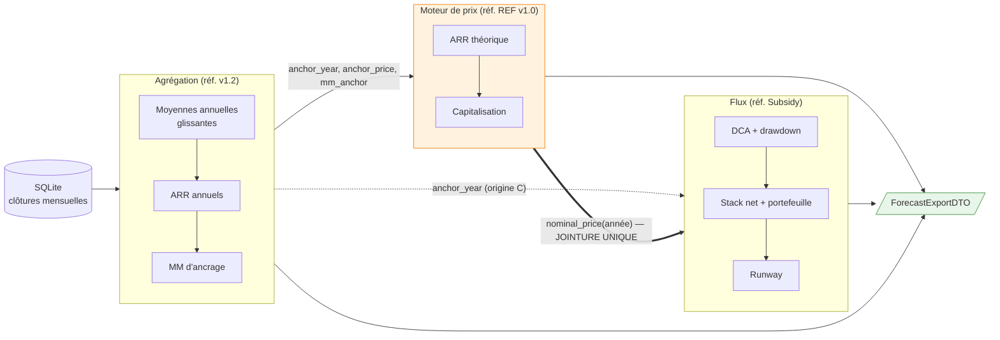
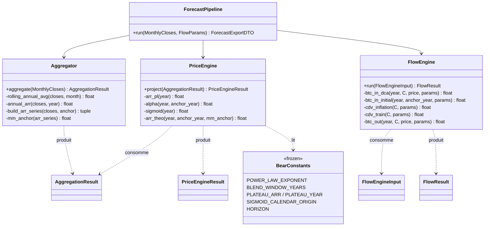

# Spécification technique — Moteur de calcul (métier)

**Projet :** Bitcoin Retirement Forecast — migration Python (scénario Bear)
**Bloc :** Spec technique 8 — Moteur de calcul (pipeline Agrégation → Moteur de prix → Flux)
**Version :** v1.0
**Date :** 5 juin 2026
**Documents parents :** Cadrage v2.1 · Spec fonctionnelle Moteur de prix v1.0 · Spec fonctionnelle Agrégation v1.2 *(→ v1.3 additive en attente, cf. §3.2 et §9)* · Spec fonctionnelle Flux v1.1 · Spec technique 7 — Infra v1.1 · Plan de tests v1.0

---

## 0. Objet et couture

Cette spec définit le **HOW** du bloc métier : le pipeline déterministe qui transforme les clôtures mensuelles BTC/USD persistées en un objet d'export complet (`ForecastExportDTO`, miroir JSON de la feuille `_Export` du pilote `forecast_bear_final.ods`).

**Couture avec Spec 7 :** le **schéma du DTO** appartient à la présente spec ; l'**endpoint `/api/forecast`** qui le sérialise et le transporte appartient à Spec 7 (déjà spécifié). La lecture SQLite et le transport HTTP vivent hors de `domain/`.

**Référentiel à deux têtes (DEC-SOURCES-01) :** REF v1.0 + `forecast_bear_final.ods` font foi pour le **moteur de prix** ; `Bitcoin_Subsidy.ods` fait foi pour la **mécanique de flux**. Jointure inter-référentiels **unique** : le prix nominal annuel (`nominal_price`).

---

## 1. Stack technique

Hérite de Spec 7 : Python 3.x, modules métier **purs** sous `domain/`, sans I/O ni état. Seul ajout propre au métier : **Pydantic** pour la validation des paramètres utilisateur de flux (§4.1). Aucune autre dépendance — le métier est de l'arithmétique sur la bibliothèque standard.

---

## 2. Architecture interne

### 2.1 Principe de découpe

Trois modules **purs** sous `domain/`, chacun fidèle à un référentiel, plus un orchestrateur. « Pur » = chaque module prend des structures de données en entrée et en rend en sortie, sans I/O ni état partagé. C'est ce qui rend la **validation par composition** possible (Cadrage / Plan de tests) : on injecte le vecteur de non-régression REF dans `PriceEngine` et les vecteurs Subsidy dans `FlowEngine` sans monter ni base ni serveur. Aucun oracle end-to-end.

| Module | Fichier | Référentiel | Responsabilité |
|---|---|---|---|
| `Aggregator` | `domain/aggregation.py` | Agrégation v1.2 | clôtures mensuelles → ancre + MM d'ancrage (+ série historique) |
| `PriceEngine` | `domain/price_engine.py` | REF v1.0 | ancre + MM → série de prix nominaux projetés |
| `FlowEngine` | `domain/flow_engine.py` | Subsidy / Flux v1.1 | prix nominaux + paramètres → stack, portefeuille, runway |
| `ForecastPipeline` | `domain/pipeline.py` | — | chaîne les trois et assemble le `ForecastExportDTO` |



*Figure 1 — Pipeline Agrégation → Moteur → Flux. La flèche épaisse marque la jointure obligatoire `nominal_price`. `anchor_year` (pointillé) est une **lignée partagée**, pas une jointure : Agrégation l'émet vers les deux étages aval (origine de capitalisation pour le moteur, origine du compteur `C` pour le flux).*



*Figure 2 — Modules métier. `BearConstants` n'est lu que par `PriceEngine`. `MM_WINDOW_YEARS` n'y figure pas : il est centralisé côté `Aggregator`.*

### 2.2 `PriceEngine` — composition vérifiée sur `K37`

Les méthodes privées suivent l'ordre **loi de puissance → blend → discount → sigmoïde → plancher** (Moteur §4.6, ordre vérifié par décodage de `K37`). Toutes prennent l'**année calendaire absolue** : pas de compteur `C` côté prix (garde anti-bug V4, Moteur §4.1).

```python
def arr_pl(year):                                   # §4.2 — loi de puissance
    t = year - POWER_LAW_TIME_ORIGIN                # 2008, rail calendaire fixe
    return (t / (t - 1)) ** POWER_LAW_EXPONENT - 1

def alpha(year, anchor_year):                       # §4.3 — poids du blend, réancré sur anchor_year
    return max(0.0, 1 - (year - anchor_year) / BLEND_WINDOW_YEARS)

def sigmoid(year):                                  # §4.5 — midpoint & k FIXES (2040,5 ; ln19/14,5)
    midpoint = (SIGMOID_CALENDAR_ORIGIN + PLATEAU_YEAR) / 2
    k = SIGMOID_CONSTANT / (PLATEAU_YEAR - midpoint)
    return 1 / (1 + exp(-k * (year - midpoint)))

def arr_theo(year, anchor_year, mm_anchor):         # §4.6 — assemblage + plancher
    a = alpha(year, anchor_year)
    base = a * mm_anchor + (1 - a) * arr_pl(year)
    disc = base * BEAR_DISCOUNT                      # × 0,60
    s = sigmoid(year)
    return max(disc * (1 - s) + PLATEAU_ARR * s, PLATEAU_ARR)
```

`project()` réalise la capitalisation (§4.7) : `series[0] = (anchor_year, None, anchor_price)`, puis pour `année ∈ [anchor_year+1 .. HORIZON]` : `nominal_price(année) = nominal_price(année−1) × (1 + arr_theo(année))`. **Découplage fenêtre MM** : `project()` ne reçoit que le scalaire `mm_anchor` — il est insensible à `MM_WINDOW_YEARS`, ce qui permet le balayage `{4,6,8}` (TF3) sans toucher au moteur.

### 2.3 `FlowEngine` — mécanique Subsidy, `C` dérivé localement

`FlowEngine` calcule `C = année − anchor_year` lui-même (Flux §3.3) et boucle de `anchor_year` à `HORIZON`. Point vérifié à ne pas perdre — **DEC-DCA-03** : la dépense qui pilote le drawdown **compose** inflation ET croissance du train de vie (`cdv_train = cdv_inflation × (1+spending_growth)^C`), conformément à Subsidy (col. H puis I). L'approche REF (pistes parallèles) est écartée — donc `cdv_train` dépend de `cdv_inflation`.

```python
def btc_in_dca(year, C, price, p):                  # §4.1
    if p.monthly_dca > 0 and year <= p.dca_end_year:
        return p.monthly_dca * (1 + p.dca_growth_rate) ** C * 12 / price
    return 0.0

def btc_in_initial(year, anchor_year, p):           # §4.2 — injecté une seule fois, à l'ancre
    return p.initial_stack if year == anchor_year else 0.0

def cdv_inflation(C, p):                             # §4.3 — informatif
    return p.monthly_expenses * 12 * (1 + p.inflation_rate) ** C

def cdv_train(C, p):                                 # §4.3 — pilote la dépense (compose, DEC-DCA-03)
    return cdv_inflation(C, p) * (1 + p.spending_growth_rate) ** C

def btc_out(year, C, price, p):                     # §4.3
    return cdv_train(C, p) / price if year >= p.btc_spending_start_year else 0.0
```

`run()` cumule (§4.4) `stack(année) = Σ btc_in − Σ btc_out` depuis l'ancre, valorise (§4.5) `portfolio = stack × nominal_price`, et calcule le runway (§4.6) = **première** bascule `stack < 0` moins `anchor_year`, sinon `∞`. **Stack non monotone assumé** (chevauchement entrée/sortie possible) ; après épuisement, la projection **continue en négatif** (pas de logique de repositivation — fidèle à Subsidy).

### 2.4 `Aggregator` — ancre + MM d'ancrage + série historique

Pur sur la liste des clôtures mensuelles fournie par la couche données (Spec 7). Produit le `AggregationResult` (§3.3) : `anchor_year` / `anchor_price` (dernier mois clos + moyenne annuelle glissante), `mm_anchor` = moyenne de `MM_WINDOW_YEARS` (6) ARR annuels glissants **non chevauchants** (§4.3, option lisse), diagnostics (`arr_series`, `mm_window_start`) et — via Agrégation v1.3 additive — la **série historique** `annual_history` consommée par le DTO. Profondeur requise, dérivée du paramètre : `(W−1)×12 + 24` = **84 mois pour W=6**. `MM_WINDOW_YEARS` est centralisé ici, **pas** dans `BearConstants`.

### 2.5 `ForecastPipeline` — chaînage

```
run(closes, flow_params):
    agg   = Aggregator.aggregate(closes)
    price = PriceEngine.project(agg)
    flow  = FlowEngine.run(FlowEngineInput(
                anchor_year   = agg.anchor_year,
                nominal_price = { y.year: y.nominal_price for y in price.series },
                params        = flow_params))
    return assemble_dto(agg, price, flow, flow_params)
```

---

## 3. Structures de données

Dataclasses Python, champs en anglais (convention projet). Tous les prix et taux en `float` (= **double IEEE-754**, décision verrouillée, cohérent avec l'oracle de non-régression). Structures `frozen` (immuables une fois produites).

### 3.1 Constantes d'intégrité Bear — `domain/constants.py`

Constantes de code, ajustables **par release uniquement**, jamais exposées en réglage utilisateur (Cadrage §4). Lues uniquement par `PriceEngine` (sauf `MM_WINDOW_YEARS`).

```python
@dataclass(frozen=True)
class BearConstants:
    POWER_LAW_EXPONENT: float    = 5.7675
    POWER_LAW_TIME_ORIGIN: int   = 2008      # rail calendaire fixe
    BEAR_DISCOUNT: float         = 0.60
    BLEND_WINDOW_YEARS: int      = 6
    PLATEAU_ARR: float           = 0.03      # figé
    PLATEAU_YEAR: int            = 2055      # figé
    SIGMOID_CONSTANT: float      = log(19)
    SIGMOID_CALENDAR_ORIGIN: int = 2026      # rail calendaire fixe (DEC-MOTEUR-01)
    HORIZON: int                 = 2072      # config réélargissable à 2100 [V2]

MM_WINDOW_YEARS: int = 6   # domain/aggregation.py — centralisé Agrégation, balayé {4,6,8} en test (TF3)
```

> **Source unique.** Ces valeurs ne sont jamais redéfinies ailleurs (ni en dur dans les formules, ni dans le DTO). Le balayage `MM_WINDOW_YEARS ∈ {4,6,8}` ne touche que cette ligne ; le moteur reste agnostique.

### 3.2 Frontière 1 — sortie Agrégation → entrée Moteur

```python
@dataclass(frozen=True)
class AggregationResult:
    # — Contrat consommé par le Moteur (Moteur v1.0 §3.1) —
    anchor_year: int          # dernier mois clos ; projection démarre à anchor_year + 1
    anchor_price: float       # USD — = rolling_annual_avg ; ≠ prix réf. F6 (KPI Flux) — NE PAS confondre
    mm_anchor: float          # taux — moyenne des MM_WINDOW_YEARS derniers ARR (MM6 en V1)
    # — Diagnostic (Agrégation §6.2), UI/logs, NON consommé par le Moteur —
    rolling_annual_avg: float          # USD — moyenne annuelle glissante (= anchor_price)
    arr_series: tuple[float, ...]      # les MM_WINDOW_YEARS ARR ayant servi à mm_anchor
    mm_window_start: date              # date du plus ancien ARR utilisé
    # — Série historique (Agrégation v1.3 additive) — consommée par le DTO (§3.6) —
    annual_history: tuple[AnnualHistoryPoint, ...]   # 2009 .. anchor_year : year, arr_reel, nominal_price
```

> **Garde-fou (Moteur §3.1).** `anchor_price` = `rolling_annual_avg` (dernier prix réel, type `L35`). Le « prix réf. 2025 » (`F6`) est une grandeur **distincte** qui ne sert qu'au KPI `current_portfolio` côté Flux. Dans le pilote, les deux valent 101 700 ; la migration ne doit pas les fusionner.

> **Dépendance Agrégation v1.3.** Le champ `annual_history` (série historique 2009 → ancre) n'est pas déclaré en Agrégation v1.2 §6. Son ajout — strictement **additif** — est porté par un bump **Agrégation v1.2 → v1.3** (action en attente, cf. §9).

### 3.3 Sortie Moteur — porteur de la jointure

```python
@dataclass(frozen=True)
class ProjectedYear:
    year: int                    # année calendaire absolue (le Moteur n'a pas de compteur C — Moteur §4.1)
    arr_theo: float | None       # ARR théorique ; None à l'année d'ancre (porte le prix réel observé)
    nominal_price: float         # USD — capitalisation ; SEULE grandeur de jointure inter-référentiels

@dataclass(frozen=True)
class PriceEngineResult:
    anchor_year: int
    anchor_price: float
    series: tuple[ProjectedYear, ...]   # de anchor_year (arr_theo=None, prix=anchor_price) à HORIZON (2072)
```

> Règle d'ancre (Moteur §4.7) : `series[0] = ProjectedYear(anchor_year, None, anchor_price)`.

### 3.4 Frontière 2 — entrée Flux (jointure unique)

```python
@dataclass(frozen=True)
class FlowEngineInput:
    anchor_year: int                    # origine du compteur C = année − anchor_year (Flux §3.3)
    nominal_price: Mapping[int, float]  # année → prix nominal ; SEULE donnée inter-référentiels (Flux §3.2)
    params: FlowParams                  # paramètres utilisateur de flux (validés Pydantic, §4.1)
```

### 3.5 Sortie Flux

```python
@dataclass(frozen=True)
class FlowYear:
    year: int
    btc_in: float
    btc_out: float
    cdv_inflation: float
    cdv_train: float
    stack: float
    portfolio: float

@dataclass(frozen=True)
class FlowResult:
    series: tuple[FlowYear, ...]   # anchor_year .. HORIZON
    runway: int | float            # années, ou float('inf')
```

### 3.6 DTO d'export — miroir sémantique de `_Export`

**Décisions de conception :** (1) miroir **sémantique** : deux blocs `params` (objet) + `series` (tableau), pas la ligne clé/valeur entrelacée ; la ligne `'---'` de `_Export` n'est pas portée. (2) série **unique** avec discriminant `kind` et champs nullables, pas deux tableaux. (3) l'**année d'ancre** est une ligne `historical` (champs flux `null`), comme la ligne 2025 de `_Export`. (4) noms EN généralisés : `mm4` → `mm_anchor`, `prix_ref_2025` → `reference_price`.

```python
@dataclass(frozen=True)
class ForecastParams:            # ← bloc clé/valeur de _Export (ligne 1)
    current_year: int            # année_en_cours (= anchor_year + 1)
    anchor_year: int             # explicite (implicite dans _Export)
    initial_stack: float         # stack_btc        (F5)
    monthly_expenses: float      # depenses_mois    (C6)
    reference_price: float       # prix_ref_2025    (F6)  — KPI ; ≠ anchor_price (garde Moteur §3.1)
    inflation_rate: float        # inflation        (C7)
    plateau_arr: float           # plateau_arr      (F7)
    spending_growth_rate: float  # train_de_vie     (C8)
    plateau_year: int            # annee_plateau    (F8)
    mm_anchor: float             # mm4 → mm_anchor  (C12)
    runway: int | float          # runway           (F12 ; ∞ → "Infinity" à la sérialisation, §9)
    current_portfolio: float     # portfolio_actuel (F11 = F5 × F6 = initial_stack × reference_price)

@dataclass(frozen=True)
class SeriesPoint:               # ← une ligne du tableau _Export (lignes 4-68)
    year: int                    # année        (col A ← H)
    n: int                       # n            (col B ← I) = year − anchor_year
    kind: Literal["historical", "projection"]
    arr_reel: float | None       # arr_reel     (col C ← J)  — historical
    arr_theo: float | None       # arr_theo     (col D ← K)  — projection
    nominal_price: float         # prix_nominal (col E ← L)
    real_price: float            # prix_reel    (col F ← M) = nominal × (1+inflation)^(anchor_year − year)
    cdv_inflation: float | None  # cdv_inflation (col G ← N) — projection
    cdv_train: float | None      # cdv_train    (col H ← O)  — projection
    btc_out: float | None        # dep_btc      (col I ← P)  — projection
    stack: float | None          # stack_btc    (col J ← Q)  — projection
    portfolio: float | None      # portfolio    (col K ← R)  — projection

@dataclass(frozen=True)
class ForecastExportDTO:
    params: ForecastParams
    series: tuple[SeriesPoint, ...]   # 2009 .. HORIZON, sans ligne séparateur
```

**Provenance (assemblage) :**

```
assemble_dto(agg, price, flow, flow_params):
    params  ← flow_params (saisie) + agg.mm_anchor + flow.runway
              current_portfolio = flow_params.initial_stack × flow_params.reference_price
    series  ← historique (2009 .. anchor_year)  : kind="historical"
                  arr_reel, nominal_price ← agg.annual_history ; real_price dérivé
              projection (anchor_year+1 .. HORIZON) : kind="projection"
                  arr_theo, nominal_price ← price.series
                  cdv_inflation, cdv_train, btc_out, stack, portfolio ← flow.series
              real_price : dérivé en assemblage (nominal × déflateur) pour TOUTES les lignes
```

`current_portfolio = initial_stack × reference_price` — **pas** `flow.portfolio(anchor_year)` (qui vaut `initial_stack × anchor_price`). En production `reference_price ≠ anchor_price` ; le KPI suit `F11 = F5 × F6`.

### 3.7 Le contrat de jointure, énoncé

```
Référentiel PRIX (REF / forecast_bear)            Référentiel FLUX (Subsidy)
─────────────────────────────────────             ──────────────────────────
PriceEngineResult.series[*].nominal_price   ───►   FlowEngineInput.nominal_price
                                                   (consommé tel quel, aucune transformation)
```

- **Une seule grandeur traverse** la frontière inter-référentiels : `nominal_price`, indexée par année calendaire absolue, `float` (double), USD.
- `anchor_year` n'est **pas** une jointure mais une **lignée partagée** (émise par Agrégation vers Moteur *et* Flux).
- Le Moteur indexe par année absolue ; **Flux dérive `C = année − anchor_year`** lui-même. Le Moteur n'expose jamais de compteur.

### 3.8 Exemple JSON (abrégé)

```json
{
  "params": { "current_year": 2026, "anchor_year": 2025, "initial_stack": 15.0,
              "reference_price": 101700.0, "mm_anchor": 0.3613, "runway": "Infinity",
              "current_portfolio": 1525500.0, "plateau_arr": 0.03, "plateau_year": 2055 },
  "series": [
    { "year": 2025, "n": 0, "kind": "historical", "arr_reel": 0.5417, "arr_theo": null,
      "nominal_price": 101700.0, "real_price": 101700.0,
      "cdv_inflation": null, "cdv_train": null, "btc_out": null, "stack": null, "portfolio": null },
    { "year": 2026, "n": 1, "kind": "projection", "arr_reel": null, "arr_theo": 0.210231258,
      "nominal_price": 123080.52, "real_price": 116113.70,
      "cdv_inflation": 31800.0, "cdv_train": 32100.0, "btc_out": 0.2608, "stack": 14.7392, "portfolio": 1814107.78 }
  ]
}
```

---

## 4. Interfaces

### 4.1 Interface d'entrée — validation Pydantic des paramètres de flux

`FlowParams` est validé à la **frontière d'entrée** (POST `/api/params`, Spec 7). Les grandeurs d'Agrégation (`anchor_year`, `anchor_price`, `mm_anchor`) ne sont **pas** revalidées ici : elles viennent d'un module de confiance contrôlé en amont.

```python
class FlowParams(BaseModel):
    model_config = ConfigDict(frozen=True)
    initial_stack:           float = Field(ge=0)      # Flux v1.1 : ≥ 0 (accumulation pure autorisée)
    reference_price:         float = Field(gt=0)      # KPI current_portfolio (≠ anchor_price)
    monthly_expenses:        float = Field(gt=0)      # coût de la vie mensuel
    inflation_rate:          float = Field(ge=-1)     # taux
    spending_growth_rate:    float = Field(ge=-1)     # train de vie, par-dessus l'inflation
    btc_spending_start_year: int                      # bornes croisées ci-dessous
    monthly_dca:             float = Field(default=0, ge=0)
    dca_growth_rate:         float = Field(default=0, ge=-1)
    dca_end_year:            int | None = None
```

Validateurs croisés (référencent `anchor_year` / `HORIZON`, injectés au contexte de validation) :

| Règle | Condition | Motif si violé |
|---|---|---|
| DCA cohérent | `monthly_dca > 0` ⇒ `dca_end_year` requis | `DCA_END_REQUIRED` |
| Bornes années | `anchor_year ≤ btc_spending_start_year ≤ HORIZON` (idem `dca_end_year`) | `YEAR_OUT_OF_RANGE` |

### 4.2 Interface de sortie — points d'entrée publics des modules

```python
Aggregator.aggregate(closes: MonthlyCloses) -> AggregationResult
PriceEngine.project(agg: AggregationResult) -> PriceEngineResult
FlowEngine.run(inp: FlowEngineInput) -> FlowResult
ForecastPipeline.run(closes: MonthlyCloses, flow_params: FlowParams) -> ForecastExportDTO
```

Le `ForecastExportDTO` est sérialisé en JSON et servi par **`GET /api/forecast`** (transport en Spec 7 §4.2).

### 4.3 Interfaces externes

**Aucune au niveau métier.** `domain/` n'effectue aucun appel réseau. La synchronisation CoinGecko (keyless) et la persistance SQLite relèvent de Spec 7 / Synchro v1.3.

---

## 5. Gestion des erreurs

Le métier est volontairement **pauvre en erreurs** : des invariants garantissent l'absence des pièges classiques.

| Erreur | Condition | Comportement | Log |
|---|---|---|---|
| `INSUFFICIENT_HISTORY` | `< (W−1)×12+24` mois clos (84 pour W=6) | `mm_anchor` non calculable → 422 ; cas théorique impossible avec base depuis 2010 (Agrégation §5) | ERROR |
| `PARAM_VALIDATION` | échec Pydantic (§4.1) | 422, message par champ | WARN |
| `ARR_FLOOR` | `ARR_théo < PLATEAU_ARR` | **non-erreur** : `MAX(… ; PLATEAU_ARR)`, comportement nominal | DEBUG |

> **Invariants vérifiés — aucune garde nécessaire :**
> 1. `arr_pl` n'est jamais appelée à `année ≤ 2009` (`t−1=0`) : la projection démarre à `anchor_year+1 ≥ 2026` (`t−1 ≥ 17`).
> 2. `nominal_price > 0` à toute année (capitalisation depuis une ancre > 0, ARR planché à +3 %) ⇒ **aucune division par zéro** dans les `… / nominal_price` du flux.
> 3. `SIGMOID_GUARD` inactif : `midpoint` et `k` figés, jamais de division par zéro post-2054.

---

## 6. Performance et contraintes non-fonctionnelles

~64 années × arithmétique scalaire = exécution sub-milliseconde. Un recalcul par changement de paramètre ou par synchro. Aucun enjeu de latence ni de mémoire. Pas de cache nécessaire.

---

## 7. Sécurité

Aucune donnée sensible dans `domain/`. Les constantes d'intégrité sont des paramètres de modèle publics, **pas des secrets**. La clé CoinGecko optionnelle (jamais requise) relève de Spec 7.

---

## 8. Tests unitaires cibles

Cas que la présente spec doit rendre testables. Le **plan de campagne** (dont le balayage TF3 `MM_WINDOW_YEARS ∈ {4,6,8}`) reste le Plan de tests v1.0 ; il n'est pas dupliqué ici.

| Cas | Input | Sortie attendue |
|---|---|---|
| **Non-régression moteur** ⭐ | `anchor_year=2025, anchor_price=101700, mm_anchor=0.3613` | `nominal_price(2026..2072)` = `L37..L83` **au cent** (garde relative `1e-9`) ; `arr_theo(2026)=0.210231258`, `nominal(2026)=123080.52`, `nominal(2072)≈2373743` |
| `alpha` | années ancre / +6 / +10 | `1.0` / `0.0` / `0.0` (clampé) |
| `sigmoid` | `année = 2040.5` | `0.5` |
| `arr_theo` plancher | année tardive | jamais `< 0.03` |
| Flux DCA → drawdown | `monthly_dca>0`, `start>anchor` | accumulation puis bascule en consommation ; stack non monotone |
| Runway | stack jamais `< 0` / bascule négative | `∞` / `(année bascule − anchor_year)` ; projection continue en négatif |
| `mm_anchor` | série d'ARR | moyenne arithmétique des `W` ARR |
| DTO KPI | — | `current_portfolio = initial_stack × reference_price` (≠ `× anchor_price`) |
| Sérialisation runway | `runway = ∞` | `"Infinity"` (string JSON portable) |

**Tolérance de non-régression :** prix « au cent » + garde relative `1e-9` ; ARR / BTC `1e-9` relatif.

---

## 9. Points d'attention à l'implémentation

- **Deux réancrages vs un rail fixe.** `anchor_year` se substitue à `2025` en deux endroits (blend §4.3 ; déflateur `real_price`) ; la sigmoïde reste calée sur `2026` / `2055` **fixes**. La divergence blend↔sigmoïde dès `anchor_year ≠ 2025` est **voulue** (ancrage court terme réactif, glissement long terme calendaire).
- **`reference_price ≠ anchor_price`** pour `current_portfolio` (garde Moteur §3.1) — ne jamais fusionner.
- **Compteur `C` côté Flux uniquement**, `C=0` à l'ancre, `C=1` à la 1ʳᵉ projection (anti-bug V4). Le moteur n'a aucun compteur.
- **`cdv_train` compose inflation ET train de vie** (DEC-DCA-03) — dépend de `cdv_inflation`.
- **`mm_anchor` scalaire** : MM6 en production, MM4 (0,3613) **uniquement** dans le vecteur de non-régression.
- **Sérialisation `runway = ∞`** → `"Infinity"` (string JSON portable) ; le dashboard l'affiche `∞`.
- **Dépendance Agrégation v1.3 (additive)** : `annual_history` doit être exposé par `Aggregator` pour alimenter la série historique du DTO. Bump à réaliser et valider avant implémentation du DTO.

---

*Spécification technique 8 (moteur de calcul) v1.0. Prête pour validation. Dernier livrable de la phase B5 ; toutes les specs fonctionnelles, le plan de tests et la Spec technique 7 sont clos. Action ouverte associée : Agrégation v1.3 (ajout `annual_history`).*
